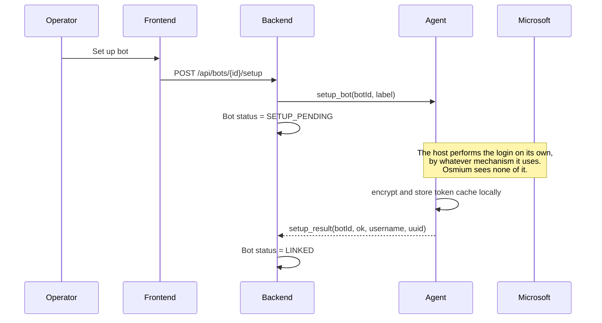
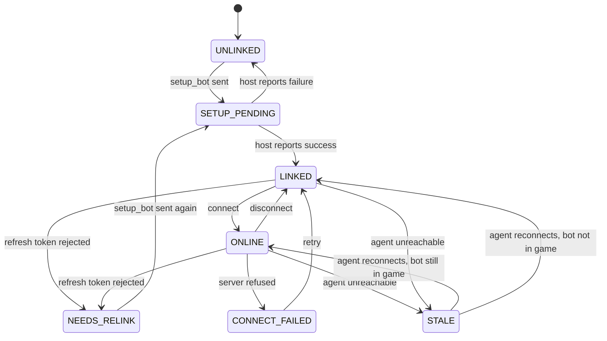
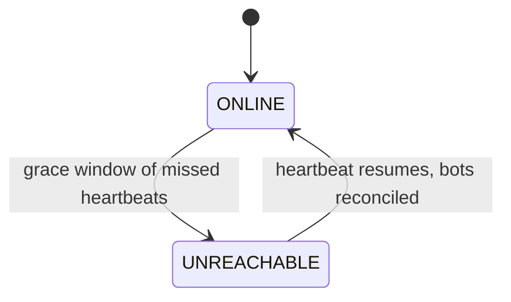

# Bot connectivity and credential custody

**Status:** proposed — nothing in this document is implemented yet. The bot views in the frontend
run on mock data (`frontend/src/stores/bots.ts`).

**Scope:** where Minecraft bots authenticate, who holds their credentials, and how an operator brings
a new bot online. *How* a host authenticates is explicitly out of scope — that is the point of the
design, not an omission.

## Problem

Osmium orchestrates Minecraft bots that collaboratively build a large schematic. Every bot needs a
Microsoft account to join a server. The requirement is that **Osmium never logs a bot into a
Microsoft account itself**, and that a compromise of the Osmium backend does not hand an attacker
those accounts.

## Decisions

1. **Authentication happens entirely on the agent host.** The backend sends a `setup_bot` command
   and receives a success or failure verdict. It does not perform, observe, or relay the login, and
   has no opinion on which mechanism the host uses.
2. **Credentials live on the agent host, never in the backend or its database.** This is the load
   bearing decision in this document.
3. The agent **dials out** to the backend over WSS and authenticates with a per-agent token, so the
   agent needs no inbound ports.
4. Setting a bot up and connecting it to a server are **separate operations**, gated by different
   permission nodes.

### Why the backend stays out of the credential path

Whatever mechanism the host uses, the end state is that it holds an **MSA refresh token**, and that
token mints Minecraft sessions for months without further human involvement. Functionally it *is*
the account.

So the question was never "how do we avoid storing passwords" — it is **"who holds the refresh
token, and what happens when that host is compromised?"** Avoiding a long-lived credential entirely
would mean re-authenticating every bot on every restart, which does not scale past a handful of
bots. The goal is therefore containment, not avoidance.

Keeping the backend out of the flow *entirely*, rather than merely out of storage, is what makes the
containment argument simple: there is no code path in Osmium that touches an authentication artefact,
so there is nothing to audit, leak, or get subtly wrong.

## Threat model

| Threat | Mitigation | Residual |
|---|---|---|
| Backend or database compromised | No credentials stored there, and no code path that handles one | Attacker learns *which* accounts exist, and can trigger `setup_bot` |
| Osmium used to phish an operator | The backend never displays an auth prompt or code, so there is nothing to imitate | — |
| Agent host compromised | Token cache encrypted at rest; revocation path documented | Root on that host gets the tokens |
| Malicious authenticated operator | Node gating + audit trail | An operator with `agent.chat` can still act in-game |
| Stolen frontend session (XSS) | Node gating limits which accounts can act | Session can drive bots until the token expires |
| Agent token leaked | Stored hashed, rotatable, revocable | Valid until revoked |

## Architecture

```
┌──────────┐        ┌──────────────────┐        ┌─────────────────────┐
│ frontend │──JWT──▶│ Spring backend   │◀──WSS──│ agent host          │
└──────────┘        │ • orchestrates   │  agent │ • performs the login│
                    │ • no MC creds    │  token │ • encrypted tokens  │──▶ Minecraft
                    │ • no auth path   │        │ • mineflayer client │     server
                    │ • audit log      │        │                     │
                    └──────────────────┘        └─────────────────────┘
                            ▲                            ▲
                            │                            │
                  knows only: label,            owns: the entire
                  username, uuid, status        authentication story
```

The backend stores bot label, Minecraft username and UUID, status, owning agent, and the target
server address. It never stores anything that can authenticate to Microsoft or Minecraft.

## Flow

### Phase 0 — enrol an agent host (once per host)

```
admin    → backend    POST /api/agents { name: "agent-eu-1" }
backend               creates Agent row, mints token, stores ONLY its hash
backend  → admin      { token: "osm_ag_9f3c…" }    ← displayed once, never again
admin    → agent host token goes into config / environment
agent    → backend    WSS connect, Authorization: Bearer osm_ag_9f3c…
backend               verifies against the hash, marks the agent online
```

One-time display is deliberate, following the pattern of a personal access token: a lost token is
rotated, not recovered.

### Phase 1 — create the bot record

```
operator → backend    POST /api/bots { label, agentId, server }
backend               Bot row: status = UNLINKED, no Minecraft identity yet
```

Nothing has touched Microsoft at this point. This is an empty slot.

### Phase 2 — set the bot up on its host

The backend sends one command and waits for a verdict. **It does not participate in, observe, or
relay the login.** How the host authenticates the account is entirely the host's business.



The only thing that crosses the WebSocket is the command and its result. On success the agent
reports the resulting **Minecraft username and UUID** — the identity, so the fleet can be displayed
and audited — and nothing else. On failure it reports a reason string suitable for showing an
operator (`cancelled`, `timed out`, `account has no Minecraft profile`), never a credential or an
intermediate auth artefact.

This is a stronger property than the backend merely not *storing* credentials: it never sees the
authentication mechanism at all. Two consequences follow.

**Osmium cannot become a phishing surface.** An earlier draft had the backend relaying a device code
up to the dashboard for the operator to type into Microsoft. That trains operators to enter codes
shown by an internal tool into a real Microsoft login — precisely the device-code phishing pattern.
Removing the relay removes the hazard rather than mitigating it.

**The host owns the auth mechanism.** Device code flow, an existing token cache, a local
credential helper — the backend's protocol is unchanged either way, and the host can change approach
without a backend release. The trade is that **completing a login requires access to the host**,
out of band from Osmium. That is a deliberate cost: it is what keeps the backend out of the
credential path entirely.

### Phase 3 — connect to the Minecraft server

```
operator → backend    POST /api/bots/{id}/connect
backend  → agent      connect(botId, host, port, version)
agent                 loads cached tokens, refreshing MSA → XBL → XSTS → MC if expired
agent                 creates the mineflayer client
agent    → backend    online(botId, position, health, food, ping)
backend  → frontend   status ONLINE
```

Phases 2 and 3 are separate because linking needs a human and connecting does not. That is what
lets a bot recover from a crash at 03:00 without waking anyone.

### Phase 4 — steady state

The agent pushes telemetry on an interval and on events (health change, chat, player enters range).
Commands travel the other way: `disconnect`, `chat`, `assignSector`.

A missed heartbeat puts a bot in `UNKNOWN`, not `OFFLINE`. Showing it as offline would claim
knowledge the system does not have.

## Bot state machine



`NEEDS_RELINK` is the state most easily forgotten. MSA refresh tokens expire — password changes,
revoked sessions, prolonged inactivity. A bot in that state cannot self-heal and the UI has to
prompt a human, so it must be distinguishable from a generic failure.

`SETUP_PENDING` may sit for a long time. The backend has handed the job to the host and has no
visibility into how far along the login is, so this state is open-ended by design: the UI shows
"awaiting setup on <host>" with no progress bar, because there is no progress to report. The host
decides when to give up and reports a failure reason.

`STALE` is covered in its own section below, because a bot enters it for a reason external to the
bot: its agent went unreachable.

## Agent liveness vs bot liveness

A host going down is a different failure from a bot disconnecting, and the two must not be collapsed
into one "offline" state. There are two independent liveness axes:

- **Agent reachability** — the backend↔agent WebSocket heartbeat. The backend observes this
  **directly**.
- **Bot in-game status** — the agent↔Minecraft connection. **Only the agent observes this.** The
  backend knows only what the agent last reported.

The backend therefore never directly knows whether a bot is in-game. It knows the last reported
status plus whether the agent is currently reachable.

### Why a lost agent is ambiguous

When an agent stops heartbeating, three causes are indistinguishable from the backend's vantage:

| Cause | Are the bots still in-game? |
|---|---|
| Host fully dead | No — gone from the server |
| Only the backend↔agent link dropped | Yes — still building |
| Agent process crashed, host fine | No — mineflayer died with the process |

Because the backend cannot tell these apart, all of that agent's bots become **`STALE`**, not
`OFFLINE`: last-known telemetry shown with an "as of Xs ago" marker and a distinct greyed-out
treatment. Rendering them red would assert knowledge the system does not have.

### The diagnostic pattern

The distinction is visible in the shape of the failure, and the UI should preserve it:

- **One bot disconnects** → a single red dot while its siblings stay green.
- **A host goes down** → *every* bot under that agent goes grey **at once**.

That difference is what tells an operator "this is a host problem, not a bot problem" before they
open anything.

### Rules that follow

1. **Never auto-act on agent loss.** No auto-reconnect, no marking bots dead. The cause is unknown,
   and acting on a wrong guess can double-connect an account — two mineflayer clients with the same
   identity, which the server kicks. Recovery is operator-initiated.
2. **The agent is the source of truth on reconnect.** When the WebSocket returns, the agent
   re-enumerates its actual live clients and reports the real set. The backend reconciles to that
   view — bots still in-game return to `ONLINE`, the rest fall to `LINKED` — and never asserts state
   back onto the agent.
3. **An agent restart is not a bot restart.** mineflayer clients die with the agent process, so
   after the agent (or its host) restarts, its bots are genuinely offline and must be reconnected
   via Phase 3. The agent reports them `LINKED` on reconnect; the token cache survives, so no fresh
   setup is needed.

### Heartbeat and grace

The agent heartbeats on a short interval (~10s). The backend flips it to `UNREACHABLE` only after a
grace window (~30s, three missed beats) so a brief network blip does not flap the whole fleet grey.
Bots transition to `STALE` at that same moment.



## Command routing

The backend never addresses a bot directly. There is one WebSocket **per host**, multiplexing every
bot that host owns, so reaching a bot is two lookups:

```
operator clicks Disconnect on Mason_01
  │
  ▼
backend   bot.hostId → host-1 → that host's open WS session
          sends { id: "cmd-7f3a", type: "disconnect", botId: "bot-1" }
  │
  ▼  (the single connection the agent dialled in on)
agent     botId → its local map of mineflayer clients
          client.quit()
  │
  ▼
agent  → backend    { id: "cmd-7f3a", ok: true } + status update
backend → frontend
```

Telemetry travels the same path in reverse. Because the channel belongs to the host rather than the
bot, `botId` is present in every message.

### Correlation ids

Every command carries an id echoed in its response. On a multiplexed channel there is otherwise no
way to map a failure back to the request that caused it, or to surface "disconnect failed" against
the control the operator actually pressed.

### Undeliverable commands fail fast

If a host's WebSocket is gone, its bots are `STALE` and commands to them are undeliverable. They must
be **rejected immediately**, not queued. Silent queueing means a command can fire twenty minutes
later when the agent reconnects — long after an operator has resolved the situation by hand — and
disconnect a bot that is deliberately running.

### Authorization is backend-side only

The agent authenticated once with its enrolment token and trusts what the backend sends; it performs
no permission checks of its own. `agent.control`, `agent.chat` and the rest are therefore enforced
**before dispatch**. The consequence is that a compromised backend can drive every bot — accepted in
exchange for the backend never holding credentials, which keeps the accounts themselves out of reach.

### Bots are not portable between hosts

A bot's token cache lives on its host's disk. Moving a bot to another host is therefore not a routing
change but a **fresh setup** (Phase 2) on the new host, requiring whatever human step that host's
login mechanism involves. Worth knowing before building any drag-to-rebalance interface: the UI
would imply an operation the credential model does not support.

## Data ownership

| Data | Backend / Postgres | Agent host |
|---|---|---|
| Bot label, server address, assigned sector | yes | — |
| Minecraft username and UUID | yes | — |
| Status, telemetry, heartbeat | yes | source of truth |
| Agent token | hash only | plaintext in config |
| MSA refresh token, Minecraft access token | **never** | encrypted at rest |

The last row is the point of the whole design. A full database dump reveals which accounts are
operated — not the ability to operate them.

Token cache handling on the agent host: mode `0600`, encrypted with a key supplied by the
environment, listed in `.gitignore` and `.dockerignore`, and mounted as a volume rather than baked
into an image.

## Permission nodes

New nodes, following the existing convention of authorizing routes on nodes and never on roles:

| Node | Grants | Suggested tier |
|---|---|---|
| `agent.read` | View bots, telemetry, nearby players | orchestrator |
| `agent.control` | Create bots, connect, disconnect, assign work | orchestrator |
| `agent.chat` | **Speak in-game as a bot** | administrator |
| `agent.login` | Enrol agents, trigger `setup_bot` on a host | administrator |

Two of these are deliberately not folded into `agent.control`:

- **`agent.chat` is impersonation.** It permits saying anything in-game under an account you own —
  a griefing and social-engineering vector, and the action most likely to get an account banned.
- **`agent.login` is credential acquisition.** It decides which Microsoft account becomes linked to
  your infrastructure.

`orchestrator` currently grants nothing beyond `viewer`. `agent.read` and `agent.control` are what
that tier exists for.

## Audit

Every `setup`, `connect`, `disconnect` and `chat` records the acting Osmium account, the target bot,
and a timestamp. Actions are taken under a real Minecraft identity; when something goes wrong
in-game, "the bot did it" is not an answer.

The audit trail records *that* a setup was triggered and what the host reported back — never how the
host authenticated, which Osmium does not know.

## Residual risks

- **Agent host compromise means account compromise.** Encryption at rest does not help if the key
  is reachable from the same box. Contained, not eliminated.
- **The frontend stores its access token in `localStorage`** (see `frontend/src/api/token.ts`).
  Before this design ships, that raises the stakes of an XSS from "attacker reads the user table"
  to "attacker drives Minecraft accounts and speaks as them". The CSP and the `v-html` lint ban move
  from advisable to required.
- **Automation is against the spirit of Microsoft's terms.** Use alternate accounts that can be
  lost, not anyone's main.
- **Break-glass revocation** is the account owner's Microsoft security page, which kills all
  sessions. Deleting the agent's token cache handles the ordinary case.
- **Completing a setup requires access to the host**, out of band from Osmium. This is the cost of
  keeping the backend out of the credential path, and it means the dashboard cannot be the only tool
  an operator needs.
- **Osmium cannot verify how a host authenticated.** A host operator could use any mechanism,
  including ones this document rejects. That trust boundary is deliberate — it is the same boundary
  that stops the backend from ever holding a credential — but it means host operators are trusted
  parties, not merely managed ones.

## Rejected alternatives

### Cookie alts

A "cookie alt" is a Microsoft account handed over as a **browser auth session cookie**
(`login.live.com` / `login.microsoftonline.com`) rather than a username and password. The cookie is
replayed to obtain an OAuth token and then the same Xbox Live → XSTS → Minecraft token chain any
login mechanism produces. They are commonly marketed as a faster way to bring up many accounts.

Rejected, for two reasons:

1. **Provenance is unacceptable.** Cookie alts are overwhelmingly sold on grey/black markets, and a
   large share are stolen or bulk-created against Microsoft's terms. That means fleet-wide batch
   bans, infrastructure built on credentials we do not own, and potentially handling other people's
   compromised accounts — categorically worse than an owned alt being banned for automation.
2. **They do not change the custody problem.** A cookie alt feeds the same token-acquisition step
   this document already covers — the host still ends up holding a long-lived Minecraft token.
   Architecturally it buys nothing; nothing here gets simpler.

Note that this rejection is now an **operational policy, not an architectural constraint**. An
earlier revision also rejected them for contradicting the manual-login requirement. That argument no
longer holds: since the backend neither performs nor observes the login, it has no opinion on the
mechanism, and a host *could* use cookie alts without Osmium being able to tell. The reason not to is
provenance, and it has to be enforced by whoever operates the hosts rather than by the protocol.

The genuine pain cookie alts claim to solve — one human approval per account — is addressed instead
by batching setup: Phase 2 is decoupled from Phase 3, so many accounts can be set up in a single
sitting and never need a human again. Account *quantity* is then a procurement question (how many
real accounts we can provision and afford to lose), not a token-format one.

## Open questions

- Does one agent host run many bots in one process, or one process per bot? Affects crash blast
  radius and memory.
- Where does sector assignment live — backend as orchestrator, or agent as scheduler?
- Do we need per-bot rate limits on chat to contain a compromised operator session?
- Does `setup_bot` carry any hints the host may act on (a preferred account, a profile name), or is
  it a bare "set up a bot for this slot"? Every field added is a small step back toward the backend
  having an opinion about credentials.
- How does an operator discover that a host is waiting on them? `SETUP_PENDING` is visible in Osmium,
  but the prompt itself lives on the host, so something has to bridge that gap operationally.
