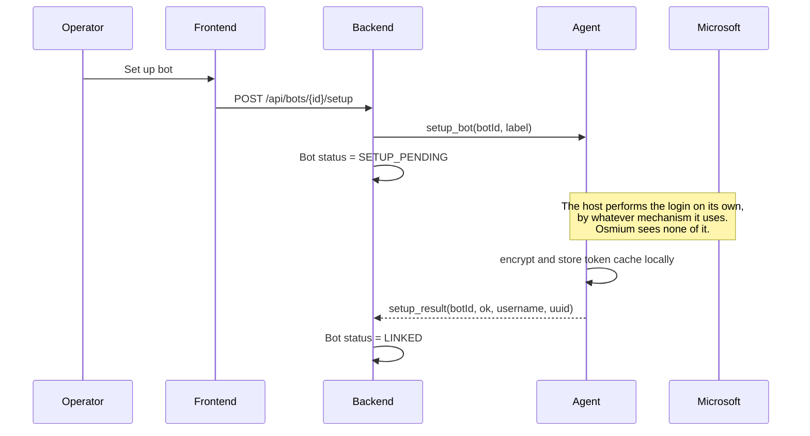
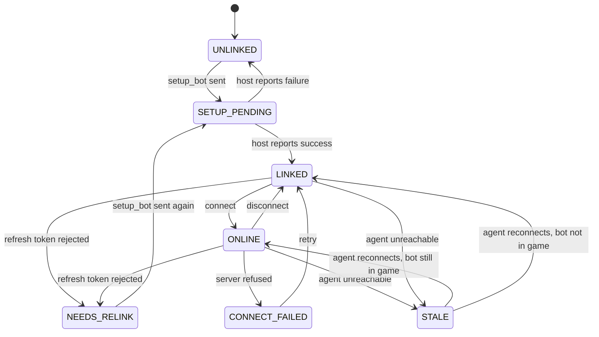
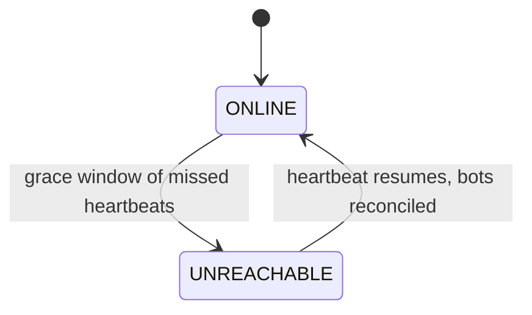

# Bot connectivity and credential custody

**Status:** partly implemented.

| Section | State |
|---|---|
| Phases 0–1, command routing, liveness, wire protocol, permission nodes | **Built** in `backend/`, covered by tests |
| Phases 2–4 — the host side of setup, connect and telemetry | **Not built**: `agent/` is a placeholder |
| Live updates (SSE), chat scoping and listener election, work assignment | **Not built** |

Telemetry, chat and build progress in the frontend are still mock
(`frontend/src/stores/bots.ts`), because nothing reports them until an agent connects. Sections not
marked built are design, not description.

**Scope:** where Minecraft bots authenticate, who holds their credentials, and how an operator brings
a new bot online. *How* a host authenticates is explicitly out of scope — that is the point of the
design, not an omission.

## Problem

Osmium orchestrates Minecraft bots that collaboratively build a large schematic. Every bot needs a
Microsoft account to join a server. The requirement is that **Osmium never logs a bot into a
Microsoft account itself**, and that a compromise of the Osmium backend does not hand an attacker
those accounts.

## Decisions

1. **Authentication happens entirely on the agent host.** The backend sends a `setup_bot` command
   and receives a success or failure verdict. It does not perform, observe, or relay the login, and
   has no opinion on which mechanism the host uses.
2. **Credentials live on the agent host, never in the backend or its database.** This is the load
   bearing decision in this document.
3. The agent **dials out** to the backend over WSS and authenticates with a per-agent token, so the
   agent needs no inbound ports.
4. Setting a bot up and connecting it to a server are **separate operations**, gated by different
   permission nodes.

### Why the backend stays out of the credential path

Whatever mechanism the host uses, the end state is that it holds an **MSA refresh token**, and that
token mints Minecraft sessions for months without further human involvement. Functionally it *is*
the account.

So the question was never "how do we avoid storing passwords" — it is **"who holds the refresh
token, and what happens when that host is compromised?"** Avoiding a long-lived credential entirely
would mean re-authenticating every bot on every restart, which does not scale past a handful of
bots. The goal is therefore containment, not avoidance.

Keeping the backend out of the flow *entirely*, rather than merely out of storage, is what makes the
containment argument simple: there is no code path in Osmium that touches an authentication artefact,
so there is nothing to audit, leak, or get subtly wrong.

## Threat model

| Threat | Mitigation | Residual |
|---|---|---|
| Backend or database compromised | No credentials stored there, and no code path that handles one | Attacker learns *which* accounts exist, and can trigger `setup_bot` |
| Osmium used to phish an operator | The backend never displays an auth prompt or code, so there is nothing to imitate | — |
| Agent host compromised | Token cache encrypted at rest; revocation path documented | Root on that host gets the tokens |
| Malicious authenticated operator | Node gating + audit trail | An operator with `agent.chat` can still act in-game |
| Stolen frontend session (XSS) | Node gating limits which accounts can act | Session can drive bots until the token expires |
| Agent token leaked | Stored hashed, rotatable, revocable | Valid until revoked |

## Architecture

```
┌──────────┐        ┌──────────────────┐        ┌─────────────────────┐
│ frontend │──JWT──▶│ Spring backend   │◀──WSS──│ agent host          │
└──────────┘        │ • orchestrates   │  agent │ • performs the login│
                    │ • no MC creds    │  token │ • encrypted tokens  │──▶ Minecraft
                    │ • no auth path   │        │ • mineflayer client │     server
                    │ • audit log      │        │                     │
                    └──────────────────┘        └─────────────────────┘
                            ▲                            ▲
                            │                            │
                  knows only: label,            owns: the entire
                  username, uuid, status        authentication story
```

The backend stores bot label, Minecraft username and UUID, status, owning agent, and the target
server address. It never stores anything that can authenticate to Microsoft or Minecraft.

## Flow

### Phase 0 — enrol an agent host (once per host)

```
admin    → backend    POST /api/agents { name: "agent-eu-1" }
backend               creates Agent row, mints token, stores ONLY its hash
backend  → admin      { token: "osm_ag_9f3c…" }    ← displayed once, never again
admin    → agent host token goes into config / environment
agent    → backend    WSS connect, Authorization: Bearer osm_ag_9f3c…
backend               verifies against the hash, marks the agent online
```

One-time display is deliberate, following the pattern of a personal access token: a lost token is
rotated, not recovered.

### Phase 1 — create the bot record

```
operator → backend    POST /api/bots { label, agentId, server }
backend               Bot row: status = UNLINKED, no Minecraft identity yet
```

Nothing has touched Microsoft at this point. This is an empty slot.

### Phase 2 — set the bot up on its host

The backend sends one command and waits for a verdict. **It does not participate in, observe, or
relay the login.** How the host authenticates the account is entirely the host's business.



The only thing that crosses the WebSocket is the command and its result. On success the agent
reports the resulting **Minecraft username and UUID** — the identity, so the fleet can be displayed
and audited — and nothing else. On failure it reports a reason string suitable for showing an
operator (`cancelled`, `timed out`, `account has no Minecraft profile`), never a credential or an
intermediate auth artefact.

This is a stronger property than the backend merely not *storing* credentials: it never sees the
authentication mechanism at all. Two consequences follow.

**Osmium cannot become a phishing surface.** An earlier draft had the backend relaying a device code
up to the dashboard for the operator to type into Microsoft. That trains operators to enter codes
shown by an internal tool into a real Microsoft login — precisely the device-code phishing pattern.
Removing the relay removes the hazard rather than mitigating it.

**The host owns the auth mechanism.** Device code flow, an existing token cache, a local
credential helper — the backend's protocol is unchanged either way, and the host can change approach
without a backend release. The trade is that **completing a login requires access to the host**,
out of band from Osmium. That is a deliberate cost: it is what keeps the backend out of the
credential path entirely.

### Phase 3 — connect to the Minecraft server

```
operator → backend    POST /api/bots/{id}/connect
backend  → agent      connect(botId, host, port, version)
agent                 loads cached tokens, refreshing MSA → XBL → XSTS → MC if expired
agent                 creates the mineflayer client
agent    → backend    online(botId, position, health, food, ping)
backend  → frontend   status ONLINE
```

Phases 2 and 3 are separate because linking needs a human and connecting does not. That is what
lets a bot recover from a crash at 03:00 without waking anyone.

### Phase 4 — steady state

The agent pushes telemetry on an interval and on events (health change, chat, player enters range).
Commands travel the other way: `disconnect`, `chat`, `assignSector`.

A missed heartbeat puts a bot in `UNKNOWN`, not `OFFLINE`. Showing it as offline would claim
knowledge the system does not have.

## Bot state machine



`NEEDS_RELINK` is the state most easily forgotten. MSA refresh tokens expire — password changes,
revoked sessions, prolonged inactivity. A bot in that state cannot self-heal and the UI has to
prompt a human, so it must be distinguishable from a generic failure.

`SETUP_PENDING` may sit for a long time. The backend has handed the job to the host and has no
visibility into how far along the login is, so this state is open-ended by design: the UI shows
"awaiting setup on <host>" with no progress bar, because there is no progress to report. The host
decides when to give up and reports a failure reason.

`STALE` is covered in its own section below, because a bot enters it for a reason external to the
bot: its agent went unreachable.

## Agent liveness vs bot liveness

A host going down is a different failure from a bot disconnecting, and the two must not be collapsed
into one "offline" state. There are two independent liveness axes:

- **Agent reachability** — the backend↔agent WebSocket heartbeat. The backend observes this
  **directly**.
- **Bot in-game status** — the agent↔Minecraft connection. **Only the agent observes this.** The
  backend knows only what the agent last reported.

The backend therefore never directly knows whether a bot is in-game. It knows the last reported
status plus whether the agent is currently reachable.

### Why a lost agent is ambiguous

When an agent stops heartbeating, three causes are indistinguishable from the backend's vantage:

| Cause | Are the bots still in-game? |
|---|---|
| Host fully dead | No — gone from the server |
| Only the backend↔agent link dropped | Yes — still building |
| Agent process crashed, host fine | No — mineflayer died with the process |

Because the backend cannot tell these apart, all of that agent's bots become **`STALE`**, not
`OFFLINE`: last-known telemetry shown with an "as of Xs ago" marker and a distinct greyed-out
treatment. Rendering them red would assert knowledge the system does not have.

### The diagnostic pattern

The distinction is visible in the shape of the failure, and the UI should preserve it:

- **One bot disconnects** → a single red dot while its siblings stay green.
- **A host goes down** → *every* bot under that agent goes grey **at once**.

That difference is what tells an operator "this is a host problem, not a bot problem" before they
open anything.

### Rules that follow

1. **Never auto-act on agent loss.** No auto-reconnect, no marking bots dead. The cause is unknown,
   and acting on a wrong guess can double-connect an account — two mineflayer clients with the same
   identity, which the server kicks. Recovery is operator-initiated.
2. **The agent is the source of truth on reconnect.** When the WebSocket returns, the agent
   re-enumerates its actual live clients and reports the real set. The backend reconciles to that
   view — bots still in-game return to `ONLINE`, the rest fall to `LINKED` — and never asserts state
   back onto the agent.
3. **An agent restart is not a bot restart.** mineflayer clients die with the agent process, so
   after the agent (or its host) restarts, its bots are genuinely offline and must be reconnected
   via Phase 3. The agent reports them `LINKED` on reconnect; the token cache survives, so no fresh
   setup is needed.

### Heartbeat and grace

The agent heartbeats on a short interval (~10s). The backend flips it to `UNREACHABLE` only after a
grace window (~30s, three missed beats) so a brief network blip does not flap the whole fleet grey.
Bots transition to `STALE` at that same moment.



## Command routing

The backend never addresses a bot directly. There is one WebSocket **per host**, multiplexing every
bot that host owns, so reaching a bot is two lookups:

```
operator clicks Disconnect on Mason_01
  │
  ▼
backend   bot.hostId → host-1 → that host's open WS session
          sends { id: "cmd-7f3a", type: "disconnect", botId: "bot-1" }
  │
  ▼  (the single connection the agent dialled in on)
agent     botId → its local map of mineflayer clients
          client.quit()
  │
  ▼
agent  → backend    { id: "cmd-7f3a", ok: true } + status update
backend → frontend
```

Telemetry travels the same path in reverse. Because the channel belongs to the host rather than the
bot, `botId` is present in every message.

### Correlation ids

Every command carries an id echoed in its response. On a multiplexed channel there is otherwise no
way to map a failure back to the request that caused it, or to surface "disconnect failed" against
the control the operator actually pressed.

### Undeliverable commands fail fast

If a host's WebSocket is gone, its bots are `STALE` and commands to them are undeliverable. They must
be **rejected immediately**, not queued. Silent queueing means a command can fire twenty minutes
later when the agent reconnects — long after an operator has resolved the situation by hand — and
disconnect a bot that is deliberately running.

### Authorization is backend-side only

The agent authenticated once with its enrolment token and trusts what the backend sends; it performs
no permission checks of its own. `agent.control`, `agent.chat` and the rest are therefore enforced
**before dispatch**. The consequence is that a compromised backend can drive every bot — accepted in
exchange for the backend never holding credentials, which keeps the accounts themselves out of reach.

### Bots are not portable between hosts

A bot's token cache lives on its host's disk. Moving a bot to another host is therefore not a routing
change but a **fresh setup** (Phase 2) on the new host, requiring whatever human step that host's
login mechanism involves. Worth knowing before building any drag-to-rebalance interface: the UI
would imply an operation the credential model does not support.

## Wire protocol

Every message on the backend↔agent WebSocket shares one envelope. The payload is **nested, not
spread across the top level**.

```jsonc
// backend → agent
{ "id": "cmd-7f3a", "kind": "command", "type": "setup_bot", "botId": 42,
  "payload": { "label": "Mason_04", "serverAddress": "mc.example.com:25565",
               "method": "device_code" } }

// agent → backend, answering it
{ "id": "cmd-7f3a", "kind": "result", "type": "setup_bot", "botId": 42,
  "ok": true, "payload": { "mcUsername": "Mason_04", "mcUuid": "…" } }

// agent → backend, unsolicited: no id, nothing is waiting on it
{ "kind": "event", "type": "bot_status", "botId": 42,
  "payload": { "state": "ONLINE", "health": 20, "position": { "x": 128, "y": 71, "z": -344 } } }

// host-scoped, so no botId
{ "kind": "event", "type": "heartbeat", "payload": { "agentVersion": "0.3.1" } }
```

### There is no destination field

The connection *is* the host. The backend selected that socket by resolving `bot.hostId`, so encoding
the host again in the message would create a second source of truth that can disagree with the socket
being written to. Only `botId` is carried, and only to route **within** a host.

`botId` is therefore **optional**: heartbeats, the version handshake and host-level errors are not
bot-scoped, and forcing a sentinel value on them would leak that sentinel through every handler.

### Why the payload is nested

- **Spread fields collide.** A payload containing its own `type` or `id` would be unrepresentable.
- **The envelope must parse without knowing the type.** Routing, correlating and logging a message
  should not require understanding its contents.
- **Forward compatibility depends on it.** The agent and backend deploy independently and will
  routinely run different versions. With a nested payload an unrecognised message still parses far
  enough to be logged and ignored; a flat discriminated union fails the whole parse.

For the same reason the backend should model this as a concrete envelope with the payload left as a
raw JSON node, decoded only after switching on `type` — rather than a fully sealed hierarchy with
polymorphic deserialisation, which is more elegant right up until an unknown `type` takes the
connection down.

### `kind` separates three different lifecycles

| kind | Direction | Correlated | Semantics |
|---|---|---|---|
| `command` | backend → agent | carries `id` | expects exactly one result |
| `result` | agent → backend | echoes `id` | resolves a pending command |
| `event` | agent → backend | no `id` | unsolicited; never awaited |

Inferring this from `type` would mean classifying every new message type in code. Declaring it makes
each message self-describing.

### `method` is a mechanism, never an account

`setup_bot` carries the login method the operator chose in the frontend — `device_code`,
`token_file`, and so on — which the backend relays without interpreting.

The line this must not cross: **a mechanism selector is fine, an account hint is not.** Relaying
"use the device code flow" says nothing about which credential results. Relaying an email address, a
profile name or a preferred account would make the backend an authority on *which* identity to
acquire, which is precisely the role this design removes from it. The same field could hold either,
so the rule has to be written down rather than inferred.

The frontend presents the choice; the backend is a courier.

### Version handshake

The agent sends `agentVersion` in its hello and the backend records it — there is already a column
for it — and logs a warning when it does not match what the backend expects.

It is **a signal, not a gate.** A hard version check causes the outage it is meant to prevent: bump
the backend and every agent in the fleet is locked out simultaneously. Tolerating unknown messages
already covers the realistic drift. The version's value is diagnostic: "why is agent-eu-3 behaving
strangely" is answered instantly by seeing it report 0.2.9.

A hard minimum is reserved for a deliberately breaking protocol change.

### Unknown messages must not be fatal

- An unknown **event** is logged and ignored. Never a disconnect: a newer agent emitting a field the
  backend has not learned about yet is normal, not an error.
- An unknown **command** gets `ok: false` with a reason, never silence. The backend has a pending
  request either way; a reply fails it fast, whereas silence hangs it until timeout.

## Live updates to the frontend

The browser channel is **receive-only**. Commands already travel over REST, where they are node-gated
and audited; the frontend only needs to be told what changed.

```
agent ──WS──▶ backend ──SSE──▶ browser
                  ▲
                  └── REST (commands, node-gated)
```

Server-sent events rather than a second WebSocket: the traffic is genuinely one-way, reconnection
with `Last-Event-ID` is part of the protocol rather than something to write, and there is no
ping/pong or close-code handling to maintain.

### Streams are scoped to the view

| Endpoint | Sends | Node |
|---|---|---|
| `GET /api/stream/fleet` | state changes, heartbeats, aggregate counters | `agent.read` |
| `GET /api/stream/bots/{id}` | that bot's chat, telemetry and state | `agent.read` |

Fanning everything to everyone wastes the wire and leaks activity across views that an operator is
not looking at.

### Four things that will bite

**`EventSource` cannot set an `Authorization` header.** The access token is held in `localStorage`
and sent as a Bearer header, which the browser's native SSE API has no way to do. Putting the token
in the query string lands it in access logs and referrers; switching to cookies reintroduces CSRF.
The fix is a **fetch-based SSE client**, which can set headers, keeping the Bearer pattern unchanged.
A browser WebSocket has the same limitation and solves it differently, by authenticating in the first
frame.

**A long-lived stream breaks instant revocation.** Authorities resolve from the database on every
REST request, so a demotion takes effect immediately — but a stream authorises once at subscribe and
then runs for hours. This is the one place that guarantee leaks. The stream must **re-check its nodes
periodically** (~30s) and close on failure, and should not outlive the token that opened it.

**The nginx config in `frontend/nginx.conf.template` currently breaks both options.** It proxies
`/api/` without the `Upgrade`/`Connection` headers a WebSocket needs, and with default buffering plus
a 60s `proxy_read_timeout`, which severs an idle SSE stream. Streaming needs `proxy_buffering off`
and a raised read timeout on the stream paths.

**Telemetry needs coalescing, not forwarding.** Chat lines and state transitions are human-paced and
can go out immediately. Position and health are not: forwarding every sample from a fleet of bots
floods both the wire and the UI. Telemetry should be throttled to a fixed tick (~1s) carrying the
latest snapshot.

### Designed for, not built yet: more than one backend instance

With two backend instances the agent's WebSocket lands on one while a browser's SSE sits on the
other, and that browser never sees the event. Solving it needs a shared broker (Redis pub/sub) or
sticky routing. Not worth building now, but worth keeping the fan-out behind a small internal
interface so that later becomes one implementation rather than a rewrite.

## Chat

"Chat" is several different things, and only some of them are per-bot. Rendering a server's global
chat on every bot's page shows the same message once per bot and drowns the signal.

**Classification happens at the agent**, which is the only place the raw packet types are visible;
the backend cannot reliably infer scope from message text.

**Chat and activity are two different feeds.** Conversation goes to chat; anything that happened *to*
a bot goes to activity. Mixing them buries a kick between two lines of small talk.

| Scope | Example | Feed | Per-bot |
|---|---|---|---|
| `outbound` | an operator made the bot speak | **chat**, and the audit log | yes |
| `direct` | a player whispers the bot | **chat** | yes |
| `local` | proximity chat, where the server has it | **chat** | mostly |
| `global` | ordinary player chat everyone sees | **chat**, one fleet-wide feed | **no** |
| `system` | kicked, banned, died, warned | **activity** | yes |
| `lifecycle` | connected, disconnected, setup failed, relink needed | **activity** | yes |

So the bot page shows only conversation that is **to or about that bot**, with its incidents in a
separate activity panel. Global chat goes to a single fleet feed on the dashboard, attributed to the
server rather than to any bot.

### Activity is incidents, not chat

`kicked`, `banned`, `died`, and connectivity transitions are not conversation. They belong in
activity, and the actionable subset also raises an entry in **Needs attention** alongside low health
and unreachable hosts.

A bot silently kicked at 03:00 is exactly the failure the dashboard exists to surface, and a line
scrolling past in a chat panel nobody has open does not surface it.

### Electing a chat listener

Global chat is identical for every bot on a server, so exactly one bot per **server** forwards it and
the rest suppress it. Election is **automatic and backend-side**: only the backend sees the whole
fleet, and bots on one server may be spread across several hosts, so no agent can tell whether
another host already has a listener.

```
backend → agent   { "kind": "command", "type": "set_chat_listener", "botId": 42,
                    "payload": { "enabled": true } }
```

Rules:

- Scope is the **server address**, not the host. Two hosts with bots on the same server share one
  listener between them.
- The incumbent is chosen for **stability, not fairness** — the longest-running `ONLINE` bot on that
  server. Rotating the role would churn the feed for no benefit.
- **Re-election only when the incumbent is lost** — it goes offline, its host becomes unreachable, or
  the bot is removed. A new bot joining a server never displaces a working listener.
- The backend waits out the existing `STALE` grace window before re-electing, so a brief network blip
  does not hand the role around.
- If no bot on a server is `ONLINE`, that server has no global feed. That is honest: nothing is
  listening.

The tradeoff accepted: **a short gap in global chat during re-election**, and global chat is only
available while at least one bot is connected. The alternative — every bot forwarding globals and
the backend deduplicating on `(server, text, time bucket)` — needs no failover but multiplies wire
traffic by the fleet size. Election was chosen; deduplication remains the fallback if the failover
logic proves fiddly.

### Persistence

- **Outbound is persisted permanently**, with the message text, in the audit log. Recording that
  operator X made bot Y speak without recording what it said is close to useless.
- **Everything else is a small per-bot ring buffer** (~50 lines), enough that a page reload is not
  blank. Inbound chat is other people's messages: not retaining it is a privacy improvement as well
  as a storage one.

### Rate limiting

Outbound chat is limited **per bot** — roughly ten messages a minute with a small burst — enforced
backend-side before dispatch.

Two concrete reasons: a stolen operator session holding `agent.chat` can otherwise spam under
accounts you own, and chat spam is the fastest route to a Minecraft ban. It is the one control here
whose in-game consequence is permanent and unrecoverable.

## Servers

A fleet can span several Minecraft servers, and **the server is a scope, not merely a field on a
bot**. Everything below hangs off it:

- the elected chat listener — **one per server**, never one per fleet
- the global chat feed
- a build: its schematic, sector assignments and progress aggregates

Blocks placed, throughput and ETA are meaningless averaged across servers, and a bot on one server
cannot help with a sector on another. Anything fleet-wide that is really build-wide has to be
grouped by server before it is shown.

The address stays a plain string on `Bot` for now; a `Server` entity earns its place the moment
schematics land, because a build needs somewhere to live and "which server" stops being incidental.

### Normalising the address

`mc.example.com` and `mc.example.com:25565` are the same server. Grouping on the raw string silently
produces two of them — two elected listeners, two chat feeds, two half-populated dashboards — and
the symptom appears far from the cause. The address is therefore lowercased and given the default
port at write time.

### One bot is one session, not one account

A `Bot` connects to exactly one server. A Minecraft account can technically hold sessions on two
servers at once, but modelling that on a single bot breaks it at every level: `ONLINE` would have to
mean online on one server and disconnected from another, and health, position, nearby players, chat
and sector assignment are all per-connection, so one bot would carry two contradictory sets.

Treating a bot as a **session** rather than an account resolves this instead of special-casing it.

Running the same account on two servers therefore means **two bot records** — and exposes a real
wrinkle worth stating before someone hits it: the host caches credentials per `botId`, so the second
bot would need its own setup for the same account. Supporting that properly means keying the host's
cache by **account** rather than by bot. Deferred, not designed for.

## Work assignment

Sector assignment lives in the **backend**. It is the orchestrator, and sector state is fleet-wide:
which sectors are claimed, blocked or queued is only knowable where the whole fleet is visible. Two
agents scheduling independently would claim the same sector.

The flow: an operator uploads a schematic and picks the bots to work it, the backend splits it into
segments, and **each bot receives only its own segment**.

That last part is deliberate. A bot never holds the full build, which keeps the payload small and
means a compromised host learns only its slice rather than the entire schematic.

The agent stays deliberately dumb about work: it receives a segment, builds it, and reports progress.
Anything more and it becomes a distributed scheduler without a coordinator — a much harder problem
than the one being solved.

## Agent process model

One agent process runs **all** of that host's bots, rather than a process per bot.

The `botId` map is then a plain in-memory lookup, and crash recovery is already cheap: a restarted
agent reconnects and reports its bots as `LINKED`, because the token cache survives on disk and no
fresh setup is needed. Process isolation would be a heavy tool for a class of bug that is simply
fixable.

Worth revisiting only if per-bot memory growth turns out to be uncontainable within one process.

## Data ownership

| Data | Backend / Postgres | Agent host |
|---|---|---|
| Bot label, server address, assigned sector | yes | — |
| Minecraft username and UUID | yes | — |
| Status, telemetry, heartbeat | yes | source of truth |
| Agent token | hash only | plaintext in config |
| MSA refresh token, Minecraft access token | **never** | encrypted at rest |

The last row is the point of the whole design. A full database dump reveals which accounts are
operated — not the ability to operate them.

Token cache handling on the agent host: mode `0600`, encrypted with a key supplied by the
environment, listed in `.gitignore` and `.dockerignore`, and mounted as a volume rather than baked
into an image.

## Permission nodes

New nodes, following the existing convention of authorizing routes on nodes and never on roles:

| Node | Grants | Tier |
|---|---|---|
| `agent.read` | View bots, telemetry, nearby players | orchestrator |
| `agent.control` | Create bots, connect, disconnect, assign work | orchestrator |
| `agent.chat` | **Speak in-game as a bot** | orchestrator |
| `agent.login` | Enrol agents, trigger `setup_bot` on a host | orchestrator |

**`orchestrator` holds full authority over the fleet.** The only thing `administrator` adds is user
management, so the tiers divide along "runs the bots" versus "runs the people".

The four nodes stay **separate anyway**, even though one tier currently holds them all, because two
of them are meaningfully more dangerous than the others and a future tier may need less:

- **`agent.chat` is impersonation.** It permits saying anything in-game under an account you own — a
  griefing and social-engineering vector, and the action most likely to get an account banned.
- **`agent.login` is credential acquisition.** It decides which Microsoft account becomes linked to
  your infrastructure.

Collapsing them into `agent.control` would make that distinction unrecoverable; keeping them apart
costs nothing today and leaves room for, say, a build-only tier that can connect bots but not speak
as them.

## Audit

Every `setup`, `connect`, `disconnect` and `chat` records the acting Osmium account, the target bot,
and a timestamp. Actions are taken under a real Minecraft identity; when something goes wrong
in-game, "the bot did it" is not an answer.

The audit trail records *that* a setup was triggered and what the host reported back — never how the
host authenticated, which Osmium does not know.

## Residual risks

- **Agent host compromise means account compromise.** Encryption at rest does not help if the key
  is reachable from the same box. Contained, not eliminated.
- **The frontend stores its access token in `localStorage`** (see `frontend/src/api/token.ts`).
  Before this design ships, that raises the stakes of an XSS from "attacker reads the user table"
  to "attacker drives Minecraft accounts and speaks as them". The CSP and the `v-html` lint ban move
  from advisable to required.
- **Automation is against the spirit of Microsoft's terms.** Use alternate accounts that can be
  lost, not anyone's main.
- **Break-glass revocation** is the account owner's Microsoft security page, which kills all
  sessions. Deleting the agent's token cache handles the ordinary case.
- **Completing a setup requires access to the host**, out of band from Osmium. This is the cost of
  keeping the backend out of the credential path, and it means the dashboard cannot be the only tool
  an operator needs.
- **Osmium cannot verify how a host authenticated.** A host operator could use any mechanism,
  including ones this document rejects. That trust boundary is deliberate — it is the same boundary
  that stops the backend from ever holding a credential — but it means host operators are trusted
  parties, not merely managed ones.

## Rejected alternatives

### Cookie alts

A "cookie alt" is a Microsoft account handed over as a **browser auth session cookie**
(`login.live.com` / `login.microsoftonline.com`) rather than a username and password. The cookie is
replayed to obtain an OAuth token and then the same Xbox Live → XSTS → Minecraft token chain any
login mechanism produces. They are commonly marketed as a faster way to bring up many accounts.

Rejected, for two reasons:

1. **Provenance is unacceptable.** Cookie alts are overwhelmingly sold on grey/black markets, and a
   large share are stolen or bulk-created against Microsoft's terms. That means fleet-wide batch
   bans, infrastructure built on credentials we do not own, and potentially handling other people's
   compromised accounts — categorically worse than an owned alt being banned for automation.
2. **They do not change the custody problem.** A cookie alt feeds the same token-acquisition step
   this document already covers — the host still ends up holding a long-lived Minecraft token.
   Architecturally it buys nothing; nothing here gets simpler.

Note that this rejection is now an **operational policy, not an architectural constraint**. An
earlier revision also rejected them for contradicting the manual-login requirement. That argument no
longer holds: since the backend neither performs nor observes the login, it has no opinion on the
mechanism, and a host *could* use cookie alts without Osmium being able to tell. The reason not to is
provenance, and it has to be enforced by whoever operates the hosts rather than by the protocol.

The genuine pain cookie alts claim to solve — one human approval per account — is addressed instead
by batching setup: Phase 2 is decoupled from Phase 3, so many accounts can be set up in a single
sitting and never need a human again. Account *quantity* is then a procurement question (how many
real accounts we can provision and afford to lose), not a token-format one.

## Open questions

- What schematic formats are accepted, and how does the backend split one into segments? Segment
  shape drives whether bots collide, queue behind each other, or work independently.
- How long is the audit log retained, and does it need exporting? It now holds chat text, which makes
  retention a policy question rather than only a storage one.
- Do login methods need per-host capability advertisement? The frontend offers a chooser, but nothing
  currently stops an operator picking a method the target host cannot perform. The host would reject
  it in `setup_result`, which works but is a late and unhelpful failure.
- Which login methods are offered in the first place?

Answered elsewhere in this document, kept here as a pointer: the process model, sector assignment,
chat scoping and listener election, chat persistence and rate limits, the `setup_bot` method field,
and the version handshake.
