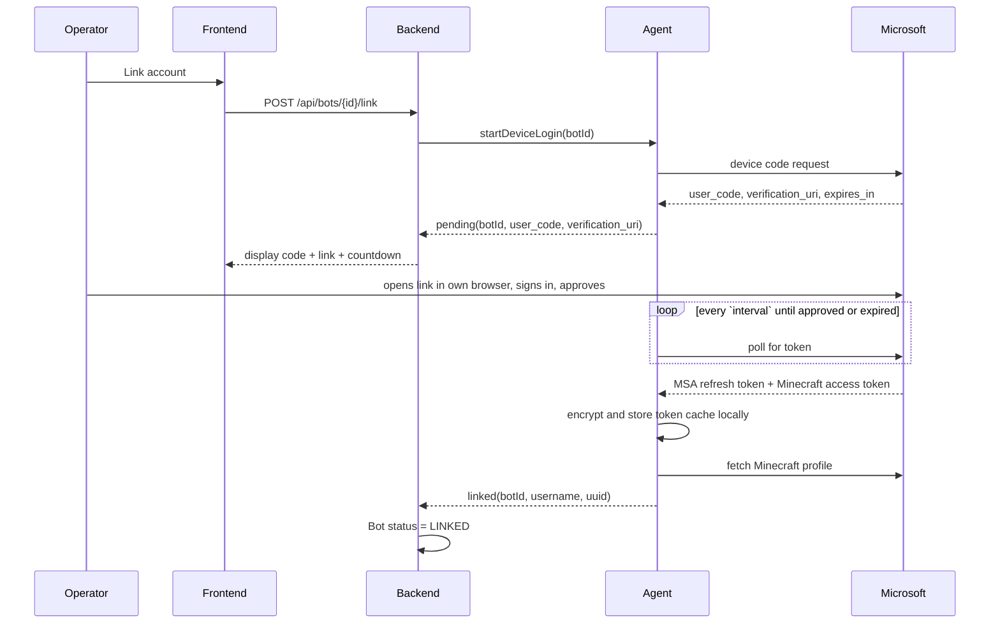
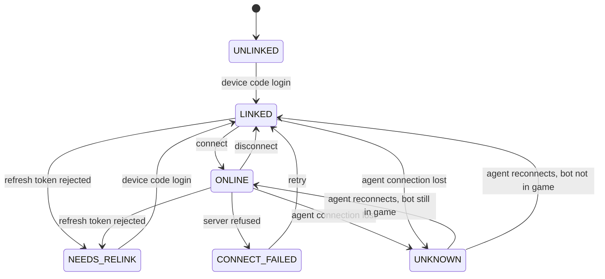

# Bot connectivity and credential custody

**Status:** proposed — nothing in this document is implemented yet. The bot views in the frontend
run on mock data (`frontend/src/stores/bots.ts`).

**Scope:** how Minecraft bots authenticate, who holds their credentials, and how an operator brings
a new bot online.

## Problem

Osmium orchestrates Minecraft bots that collaboratively build a large schematic. Every bot needs a
Microsoft account to join a server. The requirement is that **Osmium never logs a bot into a
Microsoft account itself** — a human performs the sign-in — and that a compromise of the Osmium
backend does not hand an attacker those accounts.

## Decisions

1. Authentication uses the **OAuth device code flow**. A human approves each account in their own
   browser; no password ever reaches Osmium.
2. **Credentials live on the agent host, never in the backend or its database.** This is the load
   bearing decision in this document.
3. The agent **dials out** to the backend over WSS and authenticates with a per-agent token, so the
   agent needs no inbound ports.
4. Linking an account and connecting to a server are **separate operations**, gated by different
   permission nodes.

### Why the device code flow is necessary but not sufficient

The device code flow means Osmium never sees a password. That much is genuinely solved. But once
the flow completes, whoever ran it holds an **MSA refresh token**, and that token mints Minecraft
sessions for months without further human involvement. Functionally it *is* the account.

So the real question was never "how do we avoid storing passwords" — it is **"who holds the refresh
token, and what happens when that host is compromised?"** Avoiding a long-lived credential entirely
would mean re-authenticating every bot on every restart, which does not scale past a handful of
bots. The goal is therefore containment, not avoidance.

## Threat model

| Threat | Mitigation | Residual |
|---|---|---|
| Backend or database compromised | No credentials stored there at all | Attacker learns *which* accounts exist |
| Agent host compromised | Token cache encrypted at rest; revocation path documented | Root on that host gets the tokens |
| Malicious authenticated operator | Node gating + audit trail | An operator with `agent.chat` can still act in-game |
| Stolen frontend session (XSS) | Node gating limits which accounts can act | Session can drive bots until the token expires |
| Agent token leaked | Stored hashed, rotatable, revocable | Valid until revoked |

## Architecture

```
┌──────────┐        ┌──────────────────┐        ┌─────────────────────┐
│ frontend │──JWT──▶│ Spring backend   │◀──WSS──│ agent host          │
└──────────┘        │ • orchestrates   │  agent │ • device code flow  │
                    │ • no MC creds    │  token │ • encrypted tokens  │──▶ Minecraft
                    │ • audit log      │        │ • mineflayer client │     server
                    └──────────────────┘        └─────────────────────┘
```

The backend stores bot label, Minecraft username and UUID, status, owning agent, and the target
server address. It never stores anything that can authenticate to Microsoft or Minecraft.

## Flow

### Phase 0 — enrol an agent host (once per host)

```
admin    → backend    POST /api/agents { name: "agent-eu-1" }
backend               creates Agent row, mints token, stores ONLY its hash
backend  → admin      { token: "osm_ag_9f3c…" }    ← displayed once, never again
admin    → agent host token goes into config / environment
agent    → backend    WSS connect, Authorization: Bearer osm_ag_9f3c…
backend               verifies against the hash, marks the agent online
```

One-time display is deliberate, following the pattern of a personal access token: a lost token is
rotated, not recovered.

### Phase 1 — create the bot record

```
operator → backend    POST /api/bots { label, agentId, server }
backend               Bot row: status = UNLINKED, no Minecraft identity yet
```

Nothing has touched Microsoft at this point. This is an empty slot.

### Phase 2 — link a Microsoft account



**Tokens never cross the WebSocket.** The backend learns only the display code — useless without the
operator's browser session — and afterwards the resulting username and UUID.

The UI must show *which bot* is being linked alongside the code. Device-code phishing works by
getting someone to enter a code on a genuine Microsoft page without considering what they are
authorising; a dashboard that displays bare codes trains operators into exactly that habit.

### Phase 3 — connect to the Minecraft server

```
operator → backend    POST /api/bots/{id}/connect
backend  → agent      connect(botId, host, port, version)
agent                 loads cached tokens, refreshing MSA → XBL → XSTS → MC if expired
agent                 creates the mineflayer client
agent    → backend    online(botId, position, health, food, ping)
backend  → frontend   status ONLINE
```

Phases 2 and 3 are separate because linking needs a human and connecting does not. That is what
lets a bot recover from a crash at 03:00 without waking anyone.

### Phase 4 — steady state

The agent pushes telemetry on an interval and on events (health change, chat, player enters range).
Commands travel the other way: `disconnect`, `chat`, `assignSector`.

A missed heartbeat puts a bot in `UNKNOWN`, not `OFFLINE`. Showing it as offline would claim
knowledge the system does not have.

## Bot state machine



`NEEDS_RELINK` is the state most easily forgotten. MSA refresh tokens expire — password changes,
revoked sessions, prolonged inactivity. A bot in that state cannot self-heal and the UI has to
prompt a human, so it must be distinguishable from a generic failure.

## Data ownership

| Data | Backend / Postgres | Agent host |
|---|---|---|
| Bot label, server address, assigned sector | yes | — |
| Minecraft username and UUID | yes | — |
| Status, telemetry, heartbeat | yes | source of truth |
| Agent token | hash only | plaintext in config |
| MSA refresh token, Minecraft access token | **never** | encrypted at rest |

The last row is the point of the whole design. A full database dump reveals which accounts are
operated — not the ability to operate them.

Token cache handling on the agent host: mode `0600`, encrypted with a key supplied by the
environment, listed in `.gitignore` and `.dockerignore`, and mounted as a volume rather than baked
into an image.

## Permission nodes

New nodes, following the existing convention of authorizing routes on nodes and never on roles:

| Node | Grants | Suggested tier |
|---|---|---|
| `agent.read` | View bots, telemetry, nearby players | orchestrator |
| `agent.control` | Create bots, connect, disconnect, assign work | orchestrator |
| `agent.chat` | **Speak in-game as a bot** | administrator |
| `agent.login` | Enrol agents, initiate a device-code login | administrator |

Two of these are deliberately not folded into `agent.control`:

- **`agent.chat` is impersonation.** It permits saying anything in-game under an account you own —
  a griefing and social-engineering vector, and the action most likely to get an account banned.
- **`agent.login` is credential acquisition.** It decides which Microsoft account becomes linked to
  your infrastructure.

`orchestrator` currently grants nothing beyond `viewer`. `agent.read` and `agent.control` are what
that tier exists for.

## Audit

Every `link`, `connect`, `disconnect` and `chat` records the acting Osmium account, the target bot,
and a timestamp. Actions are taken under a real Minecraft identity; when something goes wrong
in-game, "the bot did it" is not an answer.

## Residual risks

- **Agent host compromise means account compromise.** Encryption at rest does not help if the key
  is reachable from the same box. Contained, not eliminated.
- **The frontend stores its access token in `localStorage`** (see `frontend/src/api/token.ts`).
  Before this design ships, that raises the stakes of an XSS from "attacker reads the user table"
  to "attacker drives Minecraft accounts and speaks as them". The CSP and the `v-html` lint ban move
  from advisable to required.
- **Automation is against the spirit of Microsoft's terms.** Use alternate accounts that can be
  lost, not anyone's main.
- **Break-glass revocation** is the account owner's Microsoft security page, which kills all
  sessions. Deleting the agent's token cache handles the ordinary case.

## Rejected alternatives

### Cookie alts

A "cookie alt" is a Microsoft account handed over as a **browser auth session cookie**
(`login.live.com` / `login.microsoftonline.com`) rather than a username and password. The cookie is
replayed to obtain an OAuth token and then the same Xbox Live → XSTS → Minecraft token chain the
device code flow produces. They are commonly marketed as a faster way to bring up many accounts.

Rejected, for three reasons in order of weight:

1. **They do not change the custody problem.** A cookie alt feeds the same token-acquisition step
   this document already covers — the agent host still ends up holding a long-lived Minecraft token.
   Architecturally it is a no-op; nothing here gets simpler.
2. **They contradict the manual-login requirement.** The entire appeal of cookie alts is skipping
   the human sign-in, which is the property the design exists to provide.
3. **Provenance is unacceptable.** Cookie alts are overwhelmingly sold on grey/black markets, and a
   large share are stolen or bulk-created against Microsoft's terms. That means fleet-wide batch
   bans, infrastructure built on credentials we do not own, and potentially handling other people's
   compromised accounts — categorically worse than an owned alt being banned for automation.

The genuine pain cookie alts claim to solve — one human approval per account — is addressed instead
by batching device-code enrolment: Phase 2 is decoupled from Phase 3, so many accounts can be linked
in a single sitting and never need a human again. Account *quantity* is then a procurement question
(how many real accounts we can provision and afford to lose), not a token-format one.

## Open questions

- Does one agent host run many bots in one process, or one process per bot? Affects crash blast
  radius and memory.
- Where does sector assignment live — backend as orchestrator, or agent as scheduler?
- Do we need per-bot rate limits on chat to contain a compromised operator session?
