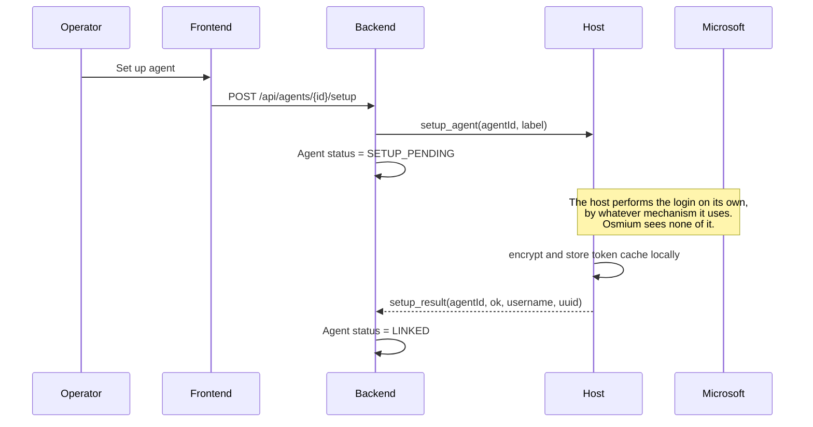
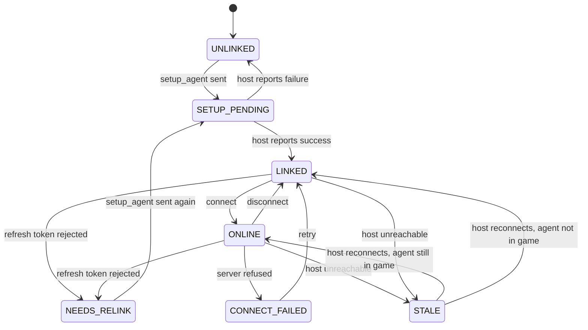
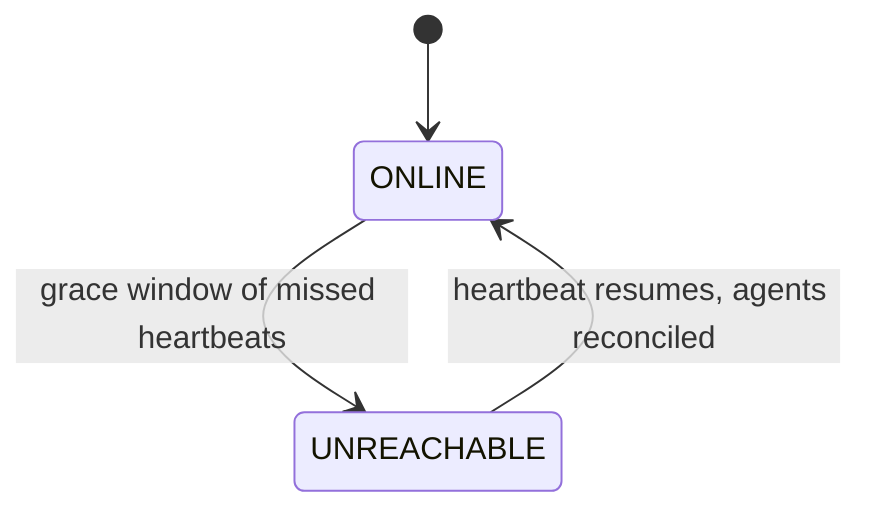

# Agent connectivity and credential custody

**Status:** partly implemented.

| Section | State |
|---|---|
| Phases 0–1, command routing, liveness, wire protocol, permission nodes | **Built** in `backend/`, covered by tests |
| The operator audit trail and its retention purge | **Built** in `backend/`, read through the frontend's Audit log page |
| Chat and activity: scoping, storage, retention, paging | **Built** in `backend/`, read through the frontend |
| Chat listener election and outbound rate limiting | **Built** in `backend/`, covered by tests |
| Telemetry: ingest, in-memory store, staleness, coalesced live event | **Built** in `backend/`, covered by tests |
| Phases 2–4 — the host side of setup, connect and telemetry | **Not built**: `host/` is a placeholder |
| Live updates over SSE | **Built**, for hosts, agents, chat, activity and telemetry |
| Work assignment and the schematic pipeline | **Not built** |

Only build progress in the frontend is still mock (`frontend/src/stores/agents.ts`) — blocks placed,
sectors, throughput and the schematic. Everything else is real but empty until a host connects.
Sections not marked built are design, not description.

**Scope:** where Minecraft agents authenticate, who holds their credentials, and how an operator
brings a new agent online. *How* a host authenticates is explicitly out of scope — that is the point
of the design, not an omission.

## Problem

Osmium orchestrates Minecraft agents that collaboratively build a large schematic. Every agent needs
a Microsoft account to join a server. The requirement is that **Osmium never logs an agent into a
Microsoft account itself**, and that a compromise of the Osmium backend does not hand an attacker
those accounts.

## Decisions

1. **Authentication happens entirely on the host.** The backend sends a `setup_agent` command
   and receives a success or failure verdict. It does not perform, observe, or relay the login, and
   has no opinion on which mechanism the host uses.
2. **Credentials live on the host, never in the backend or its database.** This is the load
   bearing decision in this document.
3. The host **dials out** to the backend over WSS and authenticates with a per-host token, so the
   host needs no inbound ports.
4. Setting an agent up and connecting it to a server are **separate operations**, gated by different
   permission nodes.

### Why the backend stays out of the credential path

Whatever mechanism the host uses, the end state is that it holds an **MSA refresh token**, and that
token mints Minecraft sessions for months without further human involvement. Functionally it *is*
the account.

So the question was never "how do we avoid storing passwords" — it is **"who holds the refresh
token, and what happens when that host is compromised?"** Avoiding a long-lived credential entirely
would mean re-authenticating every agent on every restart, which does not scale past a handful of
agents. The goal is therefore containment, not avoidance.

Keeping the backend out of the flow *entirely*, rather than merely out of storage, is what makes the
containment argument simple: there is no code path in Osmium that touches an authentication
artefact, so there is nothing to audit, leak, or get subtly wrong.

## Threat model

| Threat | Mitigation | Residual |
|---|---|---|
| Backend or database compromised | No credentials stored there, and no code path that handles one | Attacker learns *which* accounts exist, and can trigger `setup_agent` |
| Osmium used to phish an operator | The backend never displays an auth prompt or code, so there is nothing to imitate | — |
| Host host compromised | Token cache encrypted at rest; revocation path documented | Root on that host gets the tokens |
| Malicious authenticated operator | Node gating + audit trail | An operator with `fleet.chat` can still act in-game |
| Stolen frontend session (XSS) | Node gating limits which accounts can act | Session can drive agents until the token expires |
| Host token leaked | Stored hashed, rotatable, revocable | Valid until revoked |

## Architecture

```
┌──────────┐        ┌──────────────────┐        ┌─────────────────────┐
│ frontend │──JWT──▶│ Spring backend   │◀──WSS──│ host  (Rust)        │
└──────────┘  SSE   │ • orchestrates   │  host  │ • performs the login│
                    │ • no MC creds    │  token │ • encrypted tokens  │──▶ Minecraft
                    │ • no auth path   │        │ • azalea clients    │     server
                    │ • audit log      │        │                     │
                    └──────────────────┘        └─────────────────────┘
                            ▲                            ▲
                            │                            │
                  knows only: label,            owns: the entire
                  username, uuid, status        authentication story
```

The backend stores agent label, Minecraft username and UUID, status, owning host, and the target
server address. It never stores anything that can authenticate to Microsoft or Minecraft.

## Flow

### Phase 0 — enrol a host (once per host)

```
admin    → backend    POST /api/hosts { name: "host-eu-1" }
backend               creates Host row, mints token, stores ONLY its hash
backend  → admin      { token: "osm_host_9f3c…" }    ← displayed once, never again
admin    → host token goes into config / environment
host    → backend    WSS connect, Authorization: Bearer osm_host_9f3c…
backend               verifies against the hash, marks the host online
```

One-time display is deliberate, following the pattern of a personal access token: a lost token is
rotated, not recovered.

### Phase 1 — create the agent record

```
operator → backend    POST /api/agents { label, agentId, server }
backend               Agent row: status = UNLINKED, no Minecraft identity yet
```

Nothing has touched Microsoft at this point. This is an empty slot.

### Phase 2 — set the agent up on its host

The backend sends one command and waits for a verdict. **It does not participate in, observe, or
relay the login.** How the host authenticates the account is entirely the host's business.



The only thing that crosses the WebSocket is the command and its result. On success the host reports
the resulting **Minecraft username and UUID** — the identity, so the fleet can be displayed and
audited — and nothing else. On failure it reports a reason string suitable for showing an operator
(`cancelled`, `timed out`, `account has no Minecraft profile`), never a credential or an
intermediate auth artefact.

This is a stronger property than the backend merely not *storing* credentials: it never sees the
authentication mechanism at all. Two consequences follow.

**Osmium cannot become a phishing surface.** An earlier draft had the backend relaying a device code
up to the dashboard for the operator to type into Microsoft. That trains operators to enter codes
shown by an internal tool into a real Microsoft login — precisely the device-code phishing pattern.
Removing the relay removes the hazard rather than mitigating it.

**The host owns the auth mechanism.** Device code flow, an existing token cache, a local credential
helper — the backend's protocol is unchanged either way, and the host can change approach without a
backend release. The trade is that **completing a login requires access to the host**, out of band
from Osmium. That is a deliberate cost: it is what keeps the backend out of the credential path
entirely.

### Phase 3 — connect to the Minecraft server

```
operator → backend    POST /api/agents/{id}/connect
backend  → host      connect(agentId, host, port, version)
host                 loads cached tokens, refreshing MSA → XBL → XSTS → MC if expired
host                 starts the azalea client   
host    → backend    online(agentId, position, health, food, ping)
backend  → frontend   status ONLINE
```

Phases 2 and 3 are separate because linking needs a human and connecting does not. That is what lets
an agent recover from a crash at 03:00 without waking anyone.

### Phase 4 — steady state

The host pushes telemetry on an interval and on events (health change, chat, player enters range).
Commands travel the other way: `disconnect`, `chat`, `assignSector`.

A missed heartbeat puts an agent in `UNKNOWN`, not `OFFLINE`. Showing it as offline would claim
knowledge the system does not have.

## Agent state machine



`NEEDS_RELINK` is the state most easily forgotten. MSA refresh tokens expire — password changes,
revoked sessions, prolonged inactivity. An agent in that state cannot self-heal and the UI has to
prompt a human, so it must be distinguishable from a generic failure.

`SETUP_PENDING` may sit for a long time. The backend has handed the job to the host and has no
visibility into how far along the login is, so this state is open-ended by design: the UI shows
"awaiting setup on <host>" with no progress bar, because there is no progress to report. The host
decides when to give up and reports a failure reason.

`STALE` is covered in its own section below, because an agent enters it for a reason external to the
agent: its host went unreachable.

## Host liveness vs agent liveness

A host going down is a different failure from an agent disconnecting, and the two must not be
collapsed into one "offline" state. There are two independent liveness axes:

- **Host reachability** — the backend↔host WebSocket heartbeat. The backend observes this
  **directly**.
- **Agent in-game status** — the host↔Minecraft connection. **Only the host observes this.** The
  backend knows only what the host last reported.

The backend therefore never directly knows whether an agent is in-game. It knows the last reported
status plus whether the host is currently reachable.

### Why a lost host is ambiguous

When a host stops heartbeating, three causes are indistinguishable from the backend's vantage:

| Cause | Are the agents still in-game? |
|---|---|
| Host fully dead | No — gone from the server |
| Only the backend↔host link dropped | Yes — still building |
| Host process crashed, machine fine | No — its clients died with the process |

Because the backend cannot tell these apart, all of that host's agents become **`STALE`**, not
`OFFLINE`: last-known telemetry shown with an "as of Xs ago" marker and a distinct greyed-out
treatment. Rendering them red would assert knowledge the system does not have.

### The diagnostic pattern

The distinction is visible in the shape of the failure, and the UI should preserve it:

- **One agent disconnects** → a single red dot while its siblings stay green.
- **A host goes down** → *every* agent under that host goes grey **at once**.

That difference is what tells an operator "this is a host problem, not an agent problem" before they
open anything.

### Rules that follow

1. **Never auto-act on host loss.** No auto-reconnect, no marking agents dead. The cause is unknown,
   and acting on a wrong guess can double-connect an account — two clients with the same
   identity, which the server kicks. Recovery is operator-initiated.
2. **The host is the source of truth on reconnect.** When the WebSocket returns, the host
   re-enumerates its actual live clients and reports the real set. The backend reconciles to that
   view — agents still in-game return to `ONLINE`, the rest fall to `LINKED` — and never asserts state
   back onto the host.
3. **A host restart is not an agent restart.** Every client lives inside the one host process, so
   after that process restarts its agents are genuinely offline and must be reconnected
   via Phase 3. The host reports them `LINKED` on reconnect; the token cache survives, so no fresh
   setup is needed.

### Heartbeat and grace

The host heartbeats on a short interval (~10s). The backend flips it to `UNREACHABLE` only after a
grace window (~30s, three missed beats) so a brief network blip does not flap the whole fleet grey.
Agents transition to `STALE` at that same moment.



## Command routing

The backend never addresses an agent directly. There is one WebSocket **per host**, multiplexing
every agent that host owns, so reaching an agent is two lookups:

```
operator clicks Disconnect on Mason_01
  │
  ▼
backend   agent.hostId → host-1 → that host's open WS session
          sends { id: "cmd-7f3a", type: "disconnect", agentId: "agent-1" }
  │
  ▼  (the single connection the host dialled in on)
host     agentId → its local map of azalea clients
          client.quit()
  │
  ▼
host  → backend    { id: "cmd-7f3a", ok: true } + status update
backend → frontend
```

Telemetry travels the same path in reverse. Because the channel belongs to the host rather than the
agent, `agentId` is present in every message.

### Correlation ids

Every command carries an id echoed in its response. On a multiplexed channel there is otherwise no
way to map a failure back to the request that caused it, or to surface "disconnect failed" against
the control the operator actually pressed.

### Undeliverable commands fail fast

If a host's WebSocket is gone, its agents are `STALE` and commands to them are undeliverable. They
must be **rejected immediately**, not queued. Silent queueing means a command can fire twenty
minutes later when the host reconnects — long after an operator has resolved the situation by hand —
and disconnect an agent that is deliberately running.

### Authorization is backend-side only

The host authenticated once with its enrolment token and trusts what the backend sends; it performs
no permission checks of its own. `fleet.control`, `fleet.chat` and the rest are therefore enforced
**before dispatch**. The consequence is that a compromised backend can drive every agent — accepted
in exchange for the backend never holding credentials, which keeps the accounts themselves out of
reach.

### Agents are not portable between hosts

An agent's token cache lives on its host's disk. Moving an agent to another host is therefore not a
routing change but a **fresh setup** (Phase 2) on the new host, requiring whatever human step that
host's login mechanism involves. Worth knowing before building any drag-to-rebalance interface: the
UI would imply an operation the credential model does not support.

## Wire protocol

Every message on the backend↔host WebSocket shares one envelope. The payload is **nested, not spread
across the top level**.

```jsonc
// backend → host
// No server address: setting an agent up is acquiring a credential, and a Minecraft account can
// join any server. `connect` carries the address, which is where it is needed. See host/README.md.
{ "id": "cmd-7f3a", "kind": "command", "type": "setup_agent", "agentId": 42,
  "payload": { "label": "Mason_04", "method": "device_code" } }

// host → backend, answering it
{ "id": "cmd-7f3a", "kind": "result", "type": "setup_agent", "agentId": 42,
  "ok": true, "payload": { "mcUsername": "Mason_04", "mcUuid": "…" } }

// host → backend, unsolicited: no id, nothing is waiting on it
{ "kind": "event", "type": "agent_status", "agentId": 42,
  "payload": { "state": "ONLINE", "health": 20, "position": { "x": 128, "y": 71, "z": -344 } } }

// host-scoped, so no agentId
{ "kind": "event", "type": "heartbeat", "payload": { "hostVersion": "0.3.1" } }
```

### Chat and activity events

The two feeds arrive as two event types, not one type with a discriminator. The host is the side
that classifies, so sending the wrong type is an obvious mistake rather than a subtle one.

```jsonc
{ "kind": "event", "type": "chat", "agentId": 42,
  "payload": { "scope": "global", "from": "Notch", "text": "that cathedral is getting huge" } }

{ "kind": "event", "type": "activity", "agentId": 42,
  "payload": { "scope": "system", "severity": "warning",
               "text": "Kicked: flying is not enabled on this server" } }
```

| Field | Required | Values |
|---|---|---|
| `chat.scope` | yes | `outbound`, `direct`, `local`, `global` |
| `chat.from` | no | who said it; defaults to the agent's own label, which is who says an `outbound` line |
| `chat.text` | yes | truncated at 512 characters; a blank line is dropped |
| `activity.scope` | yes | `system`, `lifecycle` |
| `activity.severity` | no | `info`, `warning`, `error`; defaults to `info` |
| `activity.text` | yes | truncated at 512 characters |

Three rules that are easy to get wrong:

- **An unrecognised scope is dropped, not guessed at.** Filing a kick into chat is worse than losing
  it, since the whole reason the feeds are split is that an incident must not be buried in
  conversation.
- **Outbound chat is echoed after it is actually said**, as a `chat` event with scope `outbound`.
  The backend does not record it when it dispatches the command — what reached the server is what
  belongs in the feed, and a message that never made it should not appear as though it did.
- **There is no timestamp field.** The backend stamps the line when it receives it. Host clocks are
  not synchronised with each other, and a skewed one would file its chat into the middle of the feed
  or into the future — which in a newest-first feed means either invisible or permanently pinned to
  the top. Sub-second receive latency is the accepted cost; ordering within a reconnect replay is
  preserved by the row id.

### Reading the feeds back

All three stored streams — audit, activity, chat — are read the same way: `?limit=&cursor=`,
answering `{ items, nextCursor }`, newest first, with `nextCursor` null at the end.

**Keyset, not offset.** They are append-only and read newest-first, so `offset 200` moves by one
every time something is recorded, and a reader scrolling would see rows repeat or vanish underneath
them. The cursor is `<instant>|<id>`, where the id breaks ties on the instant — two rows in the same
instant are ordinary in a chat burst, and without the tiebreak one of them falls into the gap at a
page boundary.

`/api/chat` takes **exactly one** of `agentId` or `server`, which is the scoping rule above
expressed as a parameter: the server feed is the global chat, the agent feed is everything else.

### There is no destination field

The connection *is* the host. The backend selected that socket by resolving `agent.hostId`, so
encoding the host again in the message would create a second source of truth that can disagree with
the socket being written to. Only `agentId` is carried, and only to route **within** a host.

`agentId` is therefore **optional**: heartbeats, the version handshake and host-level errors are not
agent-scoped, and forcing a sentinel value on them would leak that sentinel through every handler.

### Why the payload is nested

- **Spread fields collide.** A payload containing its own `type` or `id` would be unrepresentable.
- **The envelope must parse without knowing the type.** Routing, correlating and logging a message
  should not require understanding its contents.
- **Forward compatibility depends on it.** The host and backend deploy independently and will
  routinely run different versions. With a nested payload an unrecognised message still parses far
  enough to be logged and ignored; a flat discriminated union fails the whole parse.

For the same reason the backend should model this as a concrete envelope with the payload left as a
raw JSON node, decoded only after switching on `type` — rather than a fully sealed hierarchy with
polymorphic deserialisation, which is more elegant right up until an unknown `type` takes the
connection down.

### `kind` separates three different lifecycles

| kind | Direction | Correlated | Semantics |
|---|---|---|---|
| `command` | backend → host | carries `id` | expects exactly one result |
| `result` | host → backend | echoes `id` | resolves a pending command |
| `event` | host → backend | no `id` | unsolicited; never awaited |

Inferring this from `type` would mean classifying every new message type in code. Declaring it makes
each message self-describing.

### `method` is a mechanism, never an account

`setup_agent` carries the login method the operator chose in the frontend, which the backend relays
without interpreting.

The real mechanisms are not decided yet, so the chooser currently offers four **placeholders** —
`method_a` through `method_d`. They exist to prove the path end to end: the frontend picks one, the
backend stores nothing about what it means, and the host receives the string verbatim. Replacing
them is a frontend list change and a host implementation, not a protocol change.

The line this must not cross: **a mechanism selector is fine, an account hint is not.** Relaying
"use the device code flow" says nothing about which credential results. Relaying an email address, a
profile name or a preferred account would make the backend an authority on *which* identity to
acquire, which is precisely the role this design removes from it. The same field could hold either,
so the rule has to be written down rather than inferred.

The frontend presents the choice; the backend is a courier.

**Hosts do not advertise which methods they support.** The chooser offers every method and an
unsupported one fails in `setup_result`. Advertisement was considered and rejected: it would put the
backend in the business of knowing what a method *is* in order to store and filter it, which is the
exact coupling `method` is written to avoid, and it buys only an earlier error message for a
selection an operator makes once per agent. A late, clear rejection is the accepted cost.

### Version handshake

The host sends `hostVersion` in its hello and the backend records it — there is already a column for
it — and logs a warning when it does not match what the backend expects.

It is **a signal, not a gate.** A hard version check causes the outage it is meant to prevent: bump
the backend and every host in the fleet is locked out simultaneously. Tolerating unknown messages
already covers the realistic drift. The version's value is diagnostic: "why is host-eu-3 behaving
strangely" is answered instantly by seeing it report 0.2.9.

A hard minimum is reserved for a deliberately breaking protocol change.

### Unknown messages must not be fatal

- An unknown **event** is logged and ignored. Never a disconnect: a newer host emitting a field the
  backend has not learned about yet is normal, not an error.
- An unknown **command** gets `ok: false` with a reason, never silence. The backend has a pending
  request either way; a reply fails it fast, whereas silence hangs it until timeout.

## Live updates to the frontend

> **Built.** Hosts, agents, chat, activity and telemetry all stream, and telemetry is coalesced onto
> a fixed tick rather than forwarded sample by sample.

The browser channel is **receive-only**. Commands already travel over REST, where they are
node-gated and audited; the frontend only needs to be told what changed.

```
host ──WS──▶ backend ──SSE──▶ browser
                  ▲
                  └── REST (commands, node-gated)
```

Server-sent events rather than a second WebSocket: the traffic is genuinely one-way, reconnection
with `Last-Event-ID` is part of the protocol rather than something to write, and there is no
ping/pong or close-code handling to maintain.

### Streams are scoped to the view

| Endpoint | Sends | Node |
|---|---|---|
| `GET /api/stream` | state changes, heartbeats, aggregate counters | `fleet.read` |
| `GET /api/stream/agents/{id}` | that agent's chat, telemetry and state | `fleet.read` |

Fanning everything to everyone wastes the wire and leaks activity across views that an operator is
not looking at.

### Four things that will bite

**`EventSource` cannot set an `Authorization` header.** The access token is held in memory and sent
as a Bearer header, which the browser's native SSE API has no way to do. Putting the token in the
query string lands it in access logs and referrers; moving it to a cookie would reintroduce CSRF on
every route, which is why the refresh cookie is scoped to `/api/auth` and the access token is not a
cookie at all. The fix is a **fetch-based SSE client**, which can set headers, keeping the Bearer
pattern unchanged. A browser WebSocket has the same limitation and solves it differently, by
authenticating in the first frame.

Two further reasons it stays hand-rolled now that a cookie does exist: `EventSource` never surfaces
keep-alive comments to JavaScript, and the idle watchdog re-arms on them; and it retries forever,
where this client gives up on a 403 that reconnecting cannot fix.

**A long-lived stream breaks instant revocation.** Authorities resolve from the database on every
REST request, so a demotion takes effect immediately — but a stream authorises once at subscribe and
then runs for hours. This is the one place that guarantee leaks. The stream must **re-check its
nodes periodically** (~30s) and close on failure, and should not outlive the token that opened it.

**The nginx config would otherwise break it.** Default buffering holds events until a buffer fills,
and the default 60s `proxy_read_timeout` severs a stream that has merely been quiet. Fixed with a
dedicated `location /api/stream/` carrying `proxy_buffering off` and a one-hour read timeout — and
deliberately *no* `add_header`, since inside a location that replaces the inherited set and would
drop the security headers for that path.

**Telemetry is coalesced, not forwarded.** Chat lines and state transitions are human-paced and go
out as they arrive. Position and health do not: forwarding every sample means a fleet of 200
reporting every five seconds puts 40 events a second on every open stream, each re-rendering a row
because someone moved by a block.

`AgentTelemetryPublisher` holds a set of agent **ids** with something new to say and publishes one
event per agent on a **1 second tick**, looking the reading up at publish time. Ids rather than
samples is what makes it coalescing rather than buffering: a burst collapses into the newest
reading, instead of a backlog the browser would render and immediately overwrite. It costs nothing
extra because the store already keeps only the latest value.

Two details that matter:

- **The pending set is cleared before publishing, not after.** A sample arriving mid-flush re-marks
  its agent and goes out on the next tick; clearing afterwards would drop it silently.
- **A tick with nothing new publishes nothing.** An idle fleet must not put an empty event on every
  stream once a second.

The tick length is the one number here trading responsiveness against event volume, and is worth
revisiting against real host traffic.

### Designed for, not built yet: more than one backend instance

With two backend instances the host's WebSocket lands on one while a browser's SSE sits on the
other, and that browser never sees the event. Solving it needs a shared broker (Redis pub/sub) or
sticky routing. Not worth building now, but worth keeping the fan-out behind a small internal
interface so that later becomes one implementation rather than a rewrite.

## Chat

"Chat" is several different things, and only some of them are per-agent. Rendering a server's global
chat on every agent's page shows the same message once per agent and drowns the signal.

**Classification happens at the host**, which is the only place the raw packet types are visible;
the backend cannot reliably infer scope from message text.

**Chat and activity are two different feeds.** Conversation goes to chat; anything that happened
*to* an agent goes to activity. Mixing them buries a kick between two lines of small talk.

| Scope | Example | Feed | Per-agent |
|---|---|---|---|
| `outbound` | an operator made the agent speak | **chat**, and the audit log | yes |
| `direct` | a player whispers the agent | **chat** | yes |
| `local` | proximity chat, where the server has it | **chat** | mostly |
| `global` | ordinary player chat everyone sees | **chat**, one fleet-wide feed | **no** |
| `system` | kicked, banned, died, warned | **activity** | yes |
| `lifecycle` | connected, disconnected, setup failed, relink needed | **activity** | yes |

So the agent page shows only conversation that is **to or about that agent**, with its incidents in
a separate activity panel. Global chat goes to a single fleet feed on the dashboard, attributed to
the server rather than to any agent.

### Activity is incidents, not chat

`kicked`, `banned`, `died`, and connectivity transitions are not conversation. They belong in
activity, and the actionable subset also raises an entry in **Needs attention** alongside low health
and unreachable hosts.

An agent silently kicked at 03:00 is exactly the failure the dashboard exists to surface, and a line
scrolling past in a chat panel nobody has open does not surface it.

### Electing a chat listener

Global chat is identical for every agent on a server, so exactly one agent per **server** forwards
it and the rest suppress it. Election is **automatic and backend-side**: only the backend sees the
whole fleet, and agents on one server may be spread across several hosts, so no host can tell
whether another host already has a listener.

```
backend → host   { "kind": "command", "type": "set_chat_listener", "agentId": 42,
                    "payload": { "enabled": true } }
```

Rules:

- Scope is the **server address**, not the host. Two hosts with agents on the same server share one
  listener between them.
- The incumbent is chosen for **stability, not fairness** — the longest-running `ONLINE` agent on that
  server. Rotating the role would churn the feed for no benefit.
- **Re-election only when the incumbent is lost** — it goes offline, its host becomes unreachable, or
  the agent is removed. A new agent joining a server never displaces a working listener.
- The backend waits out the existing `STALE` grace window before re-electing, so a brief network blip
  does not hand the role around.
- If no agent on a server is `ONLINE`, that server has no global feed. That is honest: nothing is
  listening.

The tradeoff accepted: **a short gap in global chat during re-election**, and global chat is only
available while at least one agent is connected. The alternative — every agent forwarding globals
and the backend deduplicating on `(server, text, time bucket)` — needs no failover but multiplies
wire traffic by the fleet size. Election was chosen; deduplication remains the fallback if the
failover logic proves fiddly.

#### How it actually runs

`ChatListenerService` sweeps every server on a **timer**, not on events, and the reason is specific:
`STALE` is *derived* from the host's heartbeat when a record is read, so a host going silent changes
nothing in the database and fires nothing. An event-driven election would leave a dead listener
holding the role indefinitely, and the symptom — that server's chat simply stops — gives no hint
why. The sweep runs well inside the heartbeat grace window, so the grace window is what bounds how
long a lost listener goes unnoticed, and it doubles as the retry for a command that could not be
delivered.

Two invariants hold the design together:

- **Told before recorded.** `Agent.chatListener` is only set once the `set_chat_listener` write to
  the host has gone through. Setting it first would let a server have a listener on paper and
  silence in practice, which is the one failure an operator cannot see from the dashboard.
- **Eligibility is reachable *and* writable.** An agent is a candidate only if it derives as `ONLINE`
  and its host has a live socket. A host can sit inside its grace window with the connection already
  gone — a closed laptop, a killed process — and electing an agent the backend cannot write to
  records a listener that was never told.

`onlineSince` exists to rank candidates, and is reset on each entry into `ONLINE` rather than
accumulated: a reconnect is a new session, so an agent that keeps dropping cannot out-rank one that
has never lost its connection.

The frontend **reads** `chatListener` off the agent rather than working out who ought to hold it.
Deriving it in the browser produced a plausible answer that could quietly disagree with which agent
was actually forwarding.

### Persistence

Three streams, three retentions. They are separated because they carry different things and age
differently, not because they are stored differently.

| Stream | Holds | Retention |
|---|---|---|
| **Operator audit** | who triggered `setup`, `connect`, `disconnect`, `chat`, and the outbound text | **30 days** |
| **Activity** | `system` and `lifecycle` events: died, kicked, connected, relink needed | **10 days** |
| **Chat** | everything said, inbound and outbound | **3 days** |

The ladder encodes how long each stream stays *useful*, which is not the same as how interesting it
is at the moment it happens.

**Audit outlives the rest** because it is the only stream about people rather than machines.
Questions like "who disconnected the fleet on Tuesday" get asked weeks later, and it is the smallest
stream by volume — a row per command, not per event. Outbound message text rides along with it,
because logging that operator X made agent Y speak without logging what it said is close to useless.

**Activity is diagnostic, and diagnostics go stale.** A crash loop or a relink storm is investigated
within days or not at all; a death from three weeks ago tells you nothing you would act on. Ten days
covers a fortnight's on-call without keeping noise forever.

**Chat is the largest stream and the only one full of other people's words**, so it gets the
shortest life. This is still a **loosening** of the original decision that inbound chat would never
be persisted at all — only a ~50-line per-agent ring buffer. Scrollback surviving a reload was
judged worth it; the 3-day window is what bounds the cost, so Osmium is a short-lived store of
third-party conversation rather than no store at all.

### Rate limiting

Outbound chat is limited **per agent** — 30 messages a minute — enforced backend-side before
dispatch, and refused with a 429.

Two concrete reasons: a stolen operator session holding `fleet.chat` can otherwise spam under
accounts you own, and chat spam is the fastest route to a Minecraft ban. It is the one control here
whose in-game consequence is permanent and unrecoverable.

**Per agent, not per operator**, because the ban lands on the account. Two operators sharing an
agent share its budget; one operator driving ten agents is not throttled across all of them.

A **token bucket** rather than a count per calendar minute. A fixed window allows the whole
allowance at 11:59:59 and the whole allowance again a second later — exactly the burst being
prevented — whereas a bucket refills continuously, so the sustained rate is the limit wherever the
messages happen to fall.

The budget lives in memory, outside the transaction, and two things follow. An **undeliverable
message is refunded**, because a rollback does not return a spent token and an operator retrying a
dead host would otherwise exhaust themselves on messages nobody saw — the same rule as the audit
trail, where nothing that failed to happen is recorded. And a **restart forgives what was spent**,
which is the right way round: being briefly too lenient is a better failure than locking an operator
out of a fleet they need to control.

## Servers

A fleet can span several Minecraft servers, and **the server is a scope, not merely a field on a
agent**. Everything below hangs off it:

- the elected chat listener — **one per server**, never one per fleet
- the global chat feed
- a build: its schematic, sector assignments and progress aggregates

Blocks placed, throughput and ETA are meaningless averaged across servers, and an agent on one
server cannot help with a sector on another. Anything fleet-wide that is really build-wide has to be
grouped by server before it is shown.

The address stays a plain string on `Agent` for now; a `Server` entity earns its place the moment
schematics land, because a build needs somewhere to live and "which server" stops being incidental.

### Normalising the address

`mc.example.com` and `mc.example.com:25565` are the same server. Grouping on the raw string silently
produces two of them — two elected listeners, two chat feeds, two half-populated dashboards — and
the symptom appears far from the cause. The address is therefore lowercased and given the default
port at write time.

### One agent is one session, not one account

A `Agent` connects to exactly one server. A Minecraft account can technically hold sessions on two
servers at once, but modelling that on a single agent breaks it at every level: `ONLINE` would have
to mean online on one server and disconnected from another, and health, position, nearby players,
chat and sector assignment are all per-connection, so one agent would carry two contradictory sets.

Treating an agent as a **session** rather than an account resolves this instead of special-casing
it.

Running the same account on two servers therefore means **two agent records** — and exposes a real
wrinkle worth stating before someone hits it: the host caches credentials per `agentId`, so the
second agent would need its own setup for the same account. Supporting that properly means keying
the host's cache by **account** rather than by agent. Deferred, not designed for.

## Work assignment

Sector assignment lives in the **backend**. It is the orchestrator, and sector state is fleet-wide:
which sectors are claimed, blocked or queued is only knowable where the whole fleet is visible. Two
hosts scheduling independently would claim the same sector.

The flow: an operator uploads a schematic and picks the agents to work it, the backend splits it
into segments, and **each agent receives only its own segment**.

That last part is deliberate. An agent never holds the full build, which keeps the payload small and
means a compromised host learns only its slice rather than the entire schematic.

The host stays deliberately dumb about work: it receives a segment, builds it, and reports progress.
Anything more and it becomes a distributed scheduler without a coordinator — a much harder problem
than the one being solved.

### Schematic formats

Both **Sponge `.schem`** and **Litematica `.litematic`** are accepted, behind a single parser
interface that normalises either into one internal block model. Everything downstream — splitting,
segment dispatch, progress — sees only that model and never learns which format was uploaded.

Two formats rather than one because they are not interchangeable in practice: `.schem` is what
current WorldEdit exports and is the simpler, palette-based, version-aware format, while
`.litematic` is what most large builds actually exist as, with multiple regions and richer metadata.
Picking one would have meant converting by hand on every upload.

The cost is paid up front, deliberately. Adding the second format later would mean retrofitting an
abstraction through splitting and dispatch once those exist, which is the expensive moment to
discover that the block model leaked format assumptions. A parser interface with two implementations
from the start forces the model to be format-neutral while it is still cheap to prove.

## Host process model

One host process runs **all** of that host's agents, rather than a process per agent. Each agent is
an [azalea](https://github.com/azalea-rs/azalea) client — Rust, so the natural unit is an async task
rather than a process, and running many in one process is the shape the library is built for.

The `agentId` map is then a plain in-memory lookup, and crash recovery is already cheap: a restarted
host reconnects and reports its agents as `LINKED`, because the token cache survives on disk and no
fresh setup is needed. Process isolation would be a heavy tool for a class of bug that is simply
fixable.

Worth revisiting only if per-agent memory growth turns out to be uncontainable within one process.

**The backend depends on none of this.** The protocol is a WebSocket carrying JSON envelopes; the
client library, language and concurrency model are the host's business, and replacing azalea needs
no backend release. This section records what is being built, not a constraint the backend enforces.

## Data ownership

| Data | Backend / Postgres | Host host |
|---|---|---|
| Agent label, server address, assigned sector | yes | — |
| Minecraft username and UUID | yes | — |
| Status, telemetry, heartbeat | yes | source of truth |
| Host token | hash only | plaintext in config |
| MSA refresh token, Minecraft access token | **never** | encrypted at rest |

The last row is the point of the whole design. A full database dump reveals which accounts are
operated — not the ability to operate them.

Token cache handling on the host: mode `0600`, encrypted with a key supplied by the environment,
listed in `.gitignore` and `.dockerignore`, and mounted as a volume rather than baked into an image.

## Permission nodes

New nodes, following the existing convention of authorizing routes on nodes and never on roles:

| Node | Grants | Tier |
|---|---|---|
| `fleet.read` | View agents, telemetry, nearby players | orchestrator |
| `fleet.control` | Create agents, connect, disconnect, assign work | orchestrator |
| `fleet.chat` | **Speak in-game as an agent** | orchestrator |
| `fleet.login` | Enrol hosts, trigger `setup_agent` on a host | orchestrator |

**`orchestrator` holds full authority over the fleet.** The only thing `administrator` adds is user
management, so the tiers divide along "runs the agents" versus "runs the people".

The four nodes stay **separate anyway**, even though one tier currently holds them all, because two
of them are meaningfully more dangerous than the others and a future tier may need less:

- **`fleet.chat` is impersonation.** It permits saying anything in-game under an account you own — a
  griefing and social-engineering vector, and the action most likely to get an account banned.
- **`fleet.login` is credential acquisition.** It decides which Microsoft account becomes linked to
  your infrastructure.

Collapsing them into `fleet.control` would make that distinction unrecoverable; keeping them apart
costs nothing today and leaves room for, say, a build-only tier that can connect agents but not
speak as them.

## Audit

> **Built**, in `backend/` and the frontend's Audit log page. The chat and activity streams described
> elsewhere in this document remain design, since nothing reports them until a host connects.

Every `setup`, `connect`, `disconnect` and `chat` records the acting Osmium account, the target
agent, and a timestamp. Actions are taken under a real Minecraft identity; when something goes wrong
in-game, "the agent did it" is not an answer.

Host enrolment, renaming, token rotation and deletion are recorded too, as are agent creation,
editing and deletion. They change what the fleet is or mint and destroy credentials, which is
exactly what an audit trail exists for.

**Account management is recorded as well** — creation, editing, deletion, role changes and password
changes — and in practice it is the group an incident turns on. `USER_ROLE_CHANGE` records both the
old and the new role, because that is the moment authority is granted.

Reads are not recorded: a trail of who listed the agents is noise that buries the entries that
matter. Neither is password material, in any form — those entries record that a password changed and
who changed it, never what it became. Outbound chat text is the deliberate exception, for the reason
above.

**An entry exists only if the command committed.** Recording happens inside the command's own
transaction, so one rejected with 503 because no host was connected leaves no trace — nothing
happened, so there is nothing to hold anyone to. The consequence worth stating: this log answers
"what was done", not "what was attempted".

The audit trail records *that* a setup was triggered and what the host reported back — never how the
host authenticated, which Osmium does not know.

**Retained 30 days** — the longest of the three streams; see the retention table under *Chat →
Persistence*. "Audit" here means **operator actions**, a different stream from the activity feed
that an agent's own events land in. The two are easy to conflate and are deliberately kept apart:
one answers "who did this", the other "what happened to this agent".

It is read through an administrator-only surface — `GET` gated on **`audit.read`**, rendered by the
frontend's Audit log page, which occupies the sidebar slot the settings page used to. The node sits
outside the `fleet.*` tier on purpose: an orchestrator has full authority over the fleet but no
standing right to read every other operator's actions, or the text they had an agent speak.

## Residual risks

- **Host host compromise means account compromise.** Encryption at rest does not help if the key
  is reachable from the same box. Contained, not eliminated.
- **An XSS can still act as the operator.** No credential is readable by script any more — the
  access token is in memory, the refresh token is an `HttpOnly` cookie (see
  `frontend/src/api/token.ts` and `session.ts`) — so a session can no longer be carried off the
  machine and used later. But a script on the page can call the API, and call refresh, for as long
  as the tab is open. Once this design ships that is the difference between "attacker reads the user
  table" and "attacker drives Minecraft accounts and speaks as them", so the CSP and the `v-html`
  lint ban are required rather than advisable: they are what stops a script running at all.
- **Automation is against the spirit of Microsoft's terms.** Use alternate accounts that can be
  lost, not anyone's main.
- **Break-glass revocation** is the account owner's Microsoft security page, which kills all
  sessions. Deleting the host's token cache handles the ordinary case.
- **Completing a setup requires access to the host**, out of band from Osmium. This is the cost of
  keeping the backend out of the credential path, and it means the dashboard cannot be the only tool
  an operator needs.
- **Osmium cannot verify how a host authenticated.** A host operator could use any mechanism,
  including ones this document rejects. That trust boundary is deliberate — it is the same boundary
  that stops the backend from ever holding a credential — but it means host operators are trusted
  parties, not merely managed ones.

## Rejected alternatives

### Cookie alts

A "cookie alt" is a Microsoft account handed over as a **browser auth session cookie**
(`login.live.com` / `login.microsoftonline.com`) rather than a username and password. The cookie is
replayed to obtain an OAuth token and then the same Xbox Live → XSTS → Minecraft token chain any
login mechanism produces. They are commonly marketed as a faster way to bring up many accounts.

Rejected, for two reasons:

1. **Provenance is unacceptable.** Cookie alts are overwhelmingly sold on grey/black markets, and a
   large share are stolen or bulk-created against Microsoft's terms. That means fleet-wide batch
   bans, infrastructure built on credentials we do not own, and potentially handling other people's
   compromised accounts — categorically worse than an owned alt being banned for automation.
2. **They do not change the custody problem.** A cookie alt feeds the same token-acquisition step
   this document already covers — the host still ends up holding a long-lived Minecraft token.
   Architecturally it buys nothing; nothing here gets simpler.

Note that this rejection is now an **operational policy, not an architectural constraint**. An
earlier revision also rejected them for contradicting the manual-login requirement. That argument no
longer holds: since the backend neither performs nor observes the login, it has no opinion on the
mechanism, and a host *could* use cookie alts without Osmium being able to tell. The reason not to
is provenance, and it has to be enforced by whoever operates the hosts rather than by the protocol.

The genuine pain cookie alts claim to solve — one human approval per account — is addressed instead
by batching setup: Phase 2 is decoupled from Phase 3, so many accounts can be set up in a single
sitting and never need a human again. Account *quantity* is then a procurement question (how many
real accounts we can provision and afford to lose), not a token-format one.

## Open questions

- **How does the backend split a schematic into segments?** The formats are settled — see *Work
  assignment → Schematic formats* — but segment *shape* is not, and it is the part that decides
  whether agents collide, queue behind each other, or work independently.
- **Does the audit log need exporting?** Retention is settled at 30 days; whether an operator can
  pull entries out, and under which node, is not.

Answered elsewhere in this document, kept here as a pointer: the process model, sector assignment,
schematic formats, chat scoping and listener election, chat persistence and retention, rate limits,
the `setup_agent` method field and why hosts do not advertise their methods, and the version
handshake.

### Recently closed

| Question | Answer |
|---|---|
| Which schematic formats? | Both `.schem` and `.litematic`, behind one parser interface |
| Which login methods? | Four placeholders, `method_a`–`method_d`, until real mechanisms are chosen |
| Per-host method advertisement? | **Rejected.** The backend stays uninterested in what a method means; an unsupported one fails in `setup_result` |
| Audit retention? | Operator audit 30 days, activity 10 days, chat 3 days |
| Where is the audit log read? | An administrator-only page in the frontend, gated on a new `audit.read` node |
| How are chat and activity carried? | Two host event types, `chat` and `activity`, scoped by the host — see *Wire protocol → Chat and activity events* |
| How are the three streams paged? | Keyset cursor `<instant>\|<id>`, newest first, scrolled rather than clicked; searching is server-side |
| How is telemetry carried? | Inside `agent_status`, alongside the state; the backend splits the two halves on receipt |
| Is telemetry stored? | **No.** Latest value in memory, aged out after 30s. Never written to Postgres |
| What is the chat rate limit? | 30 messages a minute per agent, as a token bucket, refunded when a message could not be delivered |
| How is the schema managed? | Flyway migrations with `ddl-auto=validate`; existing databases adopted by `baseline-on-migrate` |
